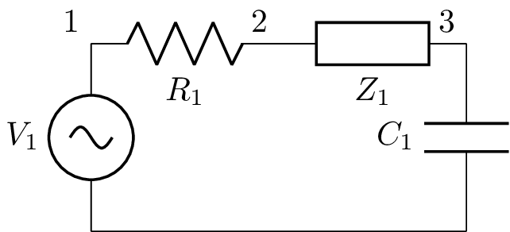

# netlist2tikz

Generación de esquemáticos electrónicos en `circuitikz` (LaTeX) a
partir de netlists tipo SPICE. Es un **fork extractivo** de
[lcapy](https://github.com/mph-/lcapy) que conserva exclusivamente
el subsistema de dibujo, sin arrastrar el motor de análisis
simbólico.

```python
from netlist2tikz import Schematic

sch = Schematic("""
V1 1 0_1 ac; down
R1 1 2; right
Z1 2 3; right, l=Z_1
C1 3 0_3; down
W 0_1 0_3; right
; draw_nodes=connections
""")
sch.draw('circuito.pdf')
```



R, L y C se dibujan con el símbolo americano clásico (zigzag,
espiral, paralelas). Las impedancias genéricas usan `Z` (`Y` para
admitancias) y se dibujan como **rectángulo IEC**.

---

## Instalación

```bash
git clone git@github.com:javovelez/netlist2tikz.git
cd netlist2tikz
python -m venv .venv && source .venv/bin/activate
pip install -e .
```

Requisitos:

- Python ≥ 3.9
- `sympy`, `numpy`, `scipy` (se instalan automáticamente)
- **Para generar PDF / PNG / SVG localmente**: distribución LaTeX con
  `circuitikz` ≥ 1.4.5 disponible en `PATH`. En macOS con MacTeX o
  BasicTeX: `sudo tlmgr install circuitikz`.
- **Si no tenés LaTeX local**: alcanza con Python. Generás el código
  TikZ con `to_tikz()` o `n2t render --tikz` y lo compilás en
  [Overleaf](https://www.overleaf.com) u otro editor en línea.
  Ver [Generación sin LaTeX local (Overleaf)](#generación-sin-latex-local-overleaf).

Verificación rápida:

```bash
python -c "from netlist2tikz import Schematic; Schematic('R1 1 0; down').draw('/tmp/test.pdf')"
```

---

## Documentación

| Documento | Propósito |
|---|---|
| **[skill/INDICE.md](skill/INDICE.md)** | Despacho de búsqueda: intención → id, vocabulario de tags, ruta curricular. Punto de entrada. |
| **[skill/COMPONENTES.md](skill/COMPONENTES.md)** | Ficha unificada por **componente** (`cpt-*`), con soporte real del fork (✅/⚠️). |
| **[skill/PARAMETROS.md](skill/PARAMETROS.md)** | Ficha unificada por **parámetro modificable** (`param-*`, `gl-*`): dirección, etiquetas, `kind`, tierras, globales. |
| **[skill/galeria/](skill/galeria/README.md)** | **Espejo navegable de ~520 esquemáticos** de lcapy + curriculares, con miniaturas, tags e índice máquina (`index.tsv`). |
| **[docs/ARQUITECTURA.md](docs/ARQUITECTURA.md)** | Cómo funciona internamente: pipeline parser → placer → emisor TikZ → pdflatex. Decisiones de diseño del fork. |

---

## Carpeta `examples/`

24 netlists curriculares listos para correr. Cada uno tiene su
`.sch` (fuente), `.pdf` (vectorial) y `.png`. Para regenerarlos:

```bash
python examples/render.py
```

Algunos destacados:

| Archivo | Tema |
|---|---|
| [01_resistor_simple.sch](examples/01_resistor_simple.sch) | Hola mundo |
| [03_rc_transitorio.sch](examples/03_rc_transitorio.sch) | Carga RC con escalón |
| [04_rlc_serie.sch](examples/04_rlc_serie.sch) | Resonante RLC serie |
| [09_impedancia_generica.sch](examples/09_impedancia_generica.sch) | Z rectángulo + R/C clásicos |
| [11_resonante_paralelo.sch](examples/11_resonante_paralelo.sch) | RLC paralelo con fuente de corriente |
| [12_fuente_VCCS.sch](examples/12_fuente_VCCS.sch) | VCCS (G) |
| [13_fuente_CCCS.sch](examples/13_fuente_CCCS.sch) | CCCS (F) |
| [15_opamp_integrador.sch](examples/15_opamp_integrador.sch) | Integrador con op-amp |
| [17_cuadripolo_T.sch](examples/17_cuadripolo_T.sch) | Cuadripolo en T |
| [18_cuadripolo_pi.sch](examples/18_cuadripolo_pi.sch) | Cuadripolo en π |
| [22_cuadripolo_caja_negra.sch](examples/22_cuadripolo_caja_negra.sch) | Cuadripolo como caja negra (TP) |
| [21_transformador_real.sch](examples/21_transformador_real.sch) | Transformador con fuga y resistencia de devanado |

Ver [docs/EJEMPLOS.md](docs/EJEMPLOS.md) para la galería completa
con vista previa.

---

## API mínima

```python
from netlist2tikz import Schematic

# Constructores explícitos
sch = Schematic.from_file('mi_circuito.sch')
sch = Schematic.from_string("R1 1 0; down\n")

# Salidas con extensión fija
sch.to_pdf('out.pdf')                # PDF vectorial
sch.to_png('out.png', dpi=600)       # PNG alta resolución
sch.to_svg('out.svg')                # SVG
sch.to_tikz()                        # → string TikZ standalone
sch.to_tikz(standalone=False)        # → solo \begin{tikzpicture}…

# Opciones globales como kwargs (anulan las del netlist)
sch.to_pdf('pelado.pdf',
           draw_nodes='none',
           label_nodes='none',
           label_ids=False,
           label_values=False)
```

El constructor genérico `Schematic(...)` y `sch.draw(filename)`
siguen funcionando (compatibilidad con docs/EJEMPLOS).

## CLI `n2t`

El paquete instala un binario `n2t`:

```bash
n2t render circuito.sch -o circuito.pdf       # formato por extensión
n2t render circuito.sch -o circuito.png --dpi 600
n2t render circuito.sch --tikz                # TikZ a stdout
n2t render circuito.sch --tikz --no-standalone > frag.tex
n2t render circuito.sch -o limpio.png --no-nodes --no-labels

n2t lint circuito.sch                          # exit 0 si parsea, 1 si no
```

Códigos de salida: `0` OK · `1` error de parseo · `2` error de render
(LaTeX/loop) · `3` I/O (archivo no encontrado, extensión desconocida).

Ver [docs/REFERENCIA.md §7](docs/REFERENCIA.md#7-cli-n2t) para detalles.

---

## Generación sin LaTeX local (Overleaf)

Si **no tenés** una distribución LaTeX instalada, podés usar el paquete
igual: generás el código TikZ y lo compilás en
[Overleaf](https://www.overleaf.com) (o cualquier editor LaTeX online).

### Opción A — Documento standalone (compilable directo)

Desde Python:

```python
from netlist2tikz import Schematic

sch = Schematic.from_string("""
V1 1 0_1 ac; down
R1 1 2; right
Z1 2 3; right, l=Z_1
C1 3 0_3; down
W 0_1 0_3; right
; draw_nodes=connections
""")

# Documento LaTeX completo, listo para compilar
print(sch.to_tikz())
```

O desde la consola:

```bash
n2t render circuito.sch -o circuito.tex     # archivo
n2t render circuito.sch --tikz > circuito.tex
```

El `circuito.tex` resultante incluye `\documentclass[standalone]{...}`,
`\usepackage{circuitikz}` y el bloque del esquemático. Pasos en
Overleaf:

1. New Project → Blank Project.
2. Borrá el `main.tex` que viene por defecto y subí (drag & drop)
   tu `circuito.tex`.
3. Asegurate de que esté seleccionado como "Main document".
4. Recompile → bajás el PDF.

### Opción B — Fragmento para insertar en tu propio documento

Si querés pegar el esquemático dentro de un apunte / TP / paper que ya
tenés en Overleaf:

```python
print(sch.to_tikz(standalone=False))
```

```bash
n2t render circuito.sch --tikz --no-standalone > fragmento.tex
```

Esto produce **solo** el bloque `\begin{tikzpicture}…\end{tikzpicture}`
(sin `\documentclass` ni preámbulo). En tu documento principal:

```latex
\documentclass{article}
\usepackage{circuitikz}     % requisito mínimo del preámbulo
\begin{document}

Y este es el circuito que vamos a analizar:

\input{fragmento.tex}       % ← se inserta el esquemático aquí

\end{document}
```

### Ejemplo concreto end-to-end

Supongamos que querés un divisor resistivo para tu TP de TCII y no
tenés LaTeX en la PC:

```bash
# 1. Crear el netlist
cat > divisor.sch <<'EOF'
V1 1 0_1 10; down
R1 1 2 1k; right=2.5
R2 2 0_2 2k; down=2
W 0_1 0_2; right=2.5
; draw_nodes=connections, label_nodes=primary
EOF

# 2. Generar el .tex standalone
n2t render divisor.sch -o divisor.tex

# 3. Inspeccionar (opcional)
head -10 divisor.tex
# \documentclass[a4paper]{standalone}
# \usepackage{amsmath}
# \usepackage{circuitikz}
# ...

# 4. Subir divisor.tex a Overleaf, recompilar, descargar PDF.
```

El `.tex` generado pesa unos pocos KB y compila en Overleaf en
segundos.

## Skill de Claude Code

El repo trae una skill lista para usar con
[Claude Code](https://claude.com/claude-code). Permite pedir circuitos
en lenguaje natural ("dibujá un divisor de tensión con R1=1k y R2=2k")
y obtener el PDF/PNG/TikZ correspondiente sin escribir el netlist a
mano.

La fuente canónica de la skill vive en `skill/` (versionada en este
repo). Para activarla en tu máquina hay que crear un symlink desde el
directorio global de skills de Claude Code:

```bash
mkdir -p ~/.claude/skills
ln -s "$(pwd)/skill" ~/.claude/skills/netlist2tikz
```

Verificación:

```bash
ls -la ~/.claude/skills/netlist2tikz/SKILL.md
# debe mostrar el symlink al skill/SKILL.md del repo
```

A partir de ahí, la skill se activa **automáticamente** cuando le
escribas a Claude algo como "dibujá un circuito RC" o "renderizá un
opamp inversor"; o **manualmente** con `/netlist2tikz`.

La skill usa el `n2t` del venv del repo (`./.venv/bin/n2t`), así que
asegurate de tener el venv creado y el paquete instalado en modo
editable:

```bash
python3 -m venv .venv && source .venv/bin/activate && pip install -e .
```

Si migrás de máquina: cloná el repo, recreá el venv y el symlink. La
skill (incluyendo templates y referencia) viaja con el repo.

Contenido de `skill/`:

```
skill/
├── SKILL.md           # instrucciones para Claude (entry point) + protocolo de búsqueda
├── INDICE.md          # despacho intención→id, vocabulario de tags, ruta curricular
├── COMPONENTES.md     # ficha unificada por componente (cpt-*)
├── PARAMETROS.md      # ficha unificada por parámetro modificable (param-*, gl-*)
└── galeria/           # espejo navegable de ~520 ejemplos
    ├── README.md      # mapa de 24 temas + cómo buscar
    ├── 00_curricular.md … 23_otros.md   # índice visual por tema (miniaturas + tags)
    ├── index.tsv      # índice máquina (id·tema·archivo·título·tags·cpts·params)
    ├── render.py      # regenera PDF/PNG + RENDER_REPORT.md
    └── sch/<tema>/*.sch (+ *.png)        # netlists + miniaturas
```

La documentación está pensada para **buscar con `rg`**: cada componente/parámetro
tiene un `id:` estable y cada `.sch` un header `# n2t-tags:` con sus tags.

## Licencia y atribución

LGPL-2.1, heredada de lcapy. Ver [LICENCE](LICENCE) y [NOTICE](NOTICE).

Upstream: https://github.com/mph-/lcapy (Copyright 2014–2025 Michael
Hayes, UCECE).
