# Galería de ejemplos

Catálogo visual de circuitos cubriendo los temas típicos de Teoría
de los Circuitos II. Cada entrada muestra el netlist exacto y la
imagen generada. Los archivos viven en
[../examples/](../examples/) y se regeneran con `python examples/render.py`.

---

## Índice

1. [Pasivos básicos](#1-pasivos-básicos)
   - [1.1 Resistencia simple](#11-resistencia-simple)
   - [1.2 Divisor resistivo (4 variantes de etiquetado)](#12-divisor-resistivo)
2. [Régimen transitorio](#2-régimen-transitorio)
   - [2.1 RC con fuente escalón](#21-rc-con-fuente-escalón)
   - [2.2 RL con cierre de llave](#22-rl-con-cierre-de-llave)
3. [Régimen senoidal y resonancia](#3-régimen-senoidal-y-resonancia)
   - [3.1 RLC serie](#31-rlc-serie)
   - [3.2 RLC paralelo](#32-rlc-paralelo)
4. [Impedancias y dipolos](#4-impedancias-y-dipolos)
   - [4.1 Impedancia genérica vs resistencia clásica](#41-impedancia-genérica-vs-resistencia-clásica)
   - [4.2 Equivalente de Thévenin](#42-equivalente-de-thévenin)
5. [Cuadripolos](#5-cuadripolos)
   - [5.1 Cuadripolo en T](#51-cuadripolo-en-t)
   - [5.2 Cuadripolo en π](#52-cuadripolo-en-π)
6. [Acoplamiento magnético](#6-acoplamiento-magnético)
   - [6.1 Transformador ideal](#61-transformador-ideal)
   - [6.2 Transformador real](#62-transformador-real)
7. [Fuentes controladas](#7-fuentes-controladas)
   - [7.1 VCCS (G)](#71-vccs-g)
   - [7.2 CCCS (F)](#72-cccs-f)
8. [Op-amps](#8-op-amps)
   - [8.1 Inversor](#81-inversor)
   - [8.2 No inversor](#82-no-inversor)
   - [8.3 Integrador](#83-integrador)
   - [8.4 Derivador](#84-derivador)
9. [Filtros pasivos](#9-filtros-pasivos)
   - [9.1 RC pasa-bajo](#91-rc-pasa-bajo)
   - [9.2 CR pasa-alto](#92-cr-pasa-alto)

---

## 1. Pasivos básicos

### 1.1 Resistencia simple

El "Hola mundo" del paquete.

**[`01_resistor_simple.sch`](../examples/01_resistor_simple.sch)**
```
R1 1 0; down
```

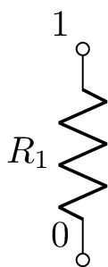

### 1.2 Divisor resistivo

Mismo circuito, cuatro variantes de etiquetado para ilustrar las
opciones `draw_nodes`, `label_nodes`, `label_ids`, `label_values`.

**Variante completa** — `[02_divisor_resistivo.sch](../examples/02_divisor_resistivo.sch)`
```
V1 1 0_1 10; down
R1 1 2 1k; right=2.5
R2 2 0_2 2k; down=2
W 0_1 0_2; right=2.5
; draw_nodes=connections, label_nodes=primary
```

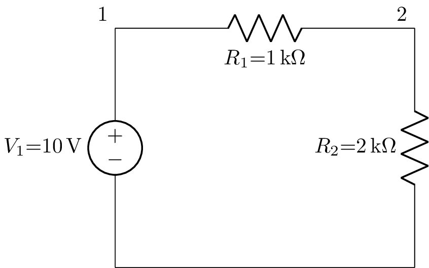

**Solo nombres** (`label_values=false`) — `[02b_divisor_solo_nombres.sch](../examples/02b_divisor_solo_nombres.sch)`

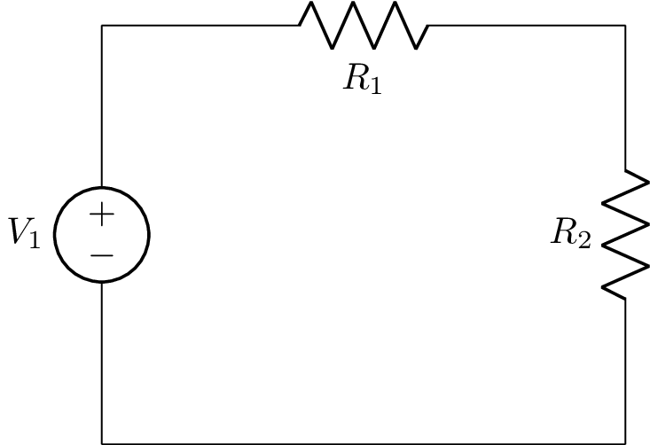

**Solo valores** (`label_ids=false`) — `[02c_divisor_solo_valores.sch](../examples/02c_divisor_solo_valores.sch)`

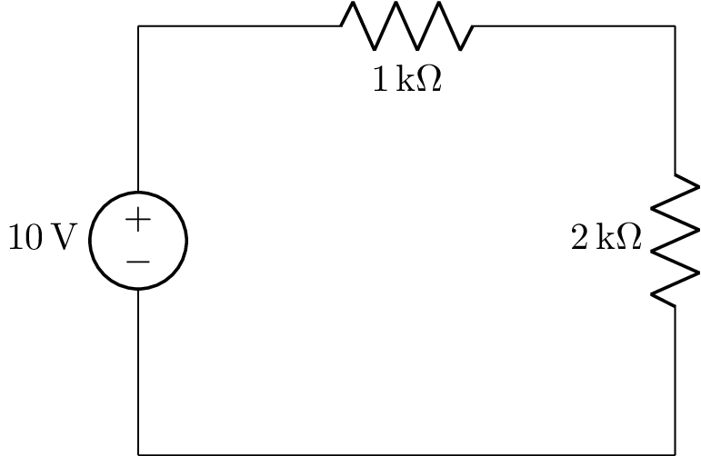

**Pelado** (todo apagado) — `[02d_divisor_pelado.sch](../examples/02d_divisor_pelado.sch)`

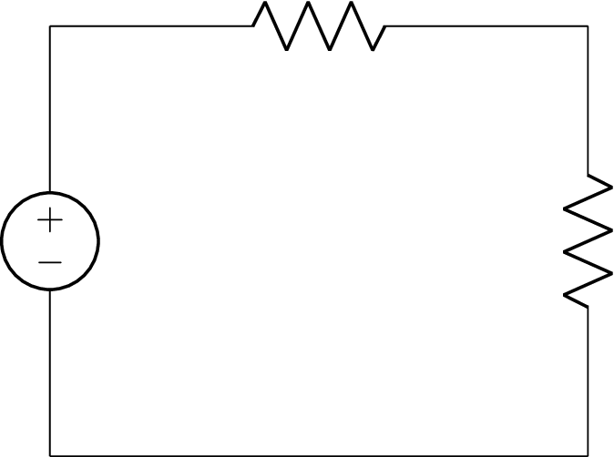

---

## 2. Régimen transitorio

### 2.1 RC con fuente escalón

Carga del capacitor con tensión escalón `step 20` (V).

**[`03_rc_transitorio.sch`](../examples/03_rc_transitorio.sch)**
```
V 1 0 step 20; down
R 1 2 10; right, size=2
C 2 0_1 1e-4; down
W 0 0_1; right
```

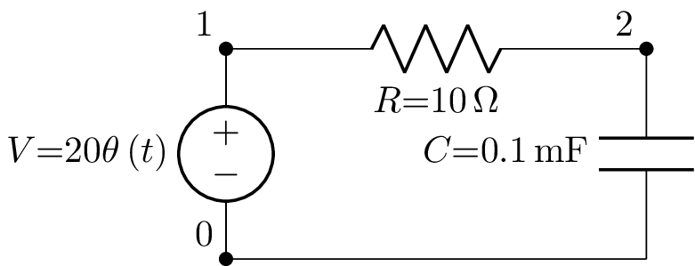

### 2.2 RL con cierre de llave

Respuesta de un RL serie a una excitación DC. Útil para mostrar
constante de tiempo τ = L/R.

**[`05_rl_con_switch.sch`](../examples/05_rl_con_switch.sch)**
```
V 1 0; down
W 1 2; right
R 2 3; right
L 3 0_3 L 0; down
W 0 0_3; right
; draw_nodes=connections
```

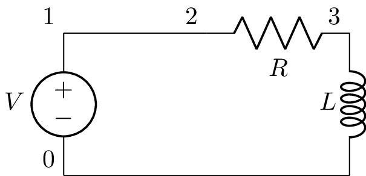

---

## 3. Régimen senoidal y resonancia

### 3.1 RLC serie

Circuito resonante serie. Fuente `ac` para indicar régimen senoidal
permanente.

**[`04_rlc_serie.sch`](../examples/04_rlc_serie.sch)**
```
V 1 0 ac; down
R 1 2; right
L 2 3; right
C 3 0_3; down
W 0 0_3; right
; draw_nodes=connections
```

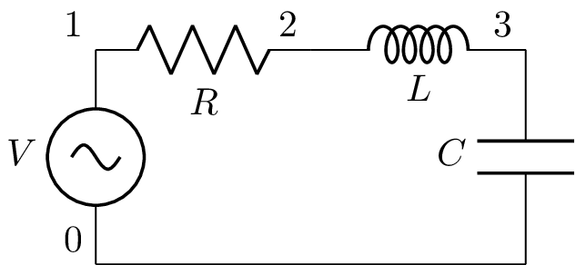

### 3.2 RLC paralelo

Fuente de corriente alimentando R, L y C en paralelo (típico para
analizar admitancia).

**[`11_resonante_paralelo.sch`](../examples/11_resonante_paralelo.sch)**
```
I1 0_1 1 ac; up
W 1 2; right
R 2 0_2; down
W 2 3; right
L 3 0_3; down
W 3 4; right
C 4 0_4; down
W 0_1 0_2; right
W 0_2 0_3; right
W 0_3 0_4; right
; draw_nodes=connections
```

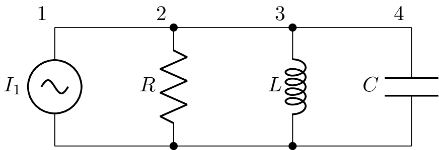

---

## 4. Impedancias y dipolos

### 4.1 Impedancia genérica vs resistencia clásica

Demuestra el comportamiento que pediste explícitamente: **R, L, C
con símbolo clásico** (zigzag, espiral, paralelas) y **Z como
rectángulo** para impedancia genérica.

**[`09_impedancia_generica.sch`](../examples/09_impedancia_generica.sch)**
```
V1 1 0_1 ac; down
R1 1 2; right
Z1 2 3; right, l=Z_1
C1 3 0_3; down
W 0_1 0_3; right
; draw_nodes=connections, label_nodes=primary
```


### 4.2 Equivalente de Thévenin

Modelo de Thévenin a la izquierda, puerto de salida a la derecha
para conectar carga.

**[`10_dipolo_thevenin.sch`](../examples/10_dipolo_thevenin.sch)**
```
V1 1 0_1 V_th; down
R1 1 2 R_th; right=2
P1 2 0_2; down, v=V_o
W 0_1 0_2; right=2
; draw_nodes=connections, label_nodes=primary
```

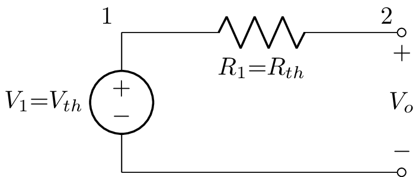

---

## 5. Cuadripolos

### 5.1 Cuadripolo en T

Red de tres impedancias genéricas en topología T. Útil para análisis
con parámetros Z, Y, H. Las flechas anotan las corrientes de puerto
con la convención de referencia pasiva.

**[`17_cuadripolo_T.sch`](../examples/17_cuadripolo_T.sch)**
```
P1 1 0; down, v_=V_1
Z1 1 2; right=2, i>^=I_1, l=Z_a
Z2 2 0_2; down=1.5, l=Z_b
Z3 2 3; right=2, i^<=I_2, l=Z_c
W 0 0_2; right
P2 3 0_3; down, v=V_2
W 0_2 0_3; right
; draw_nodes=connections, label_nodes=primary
```

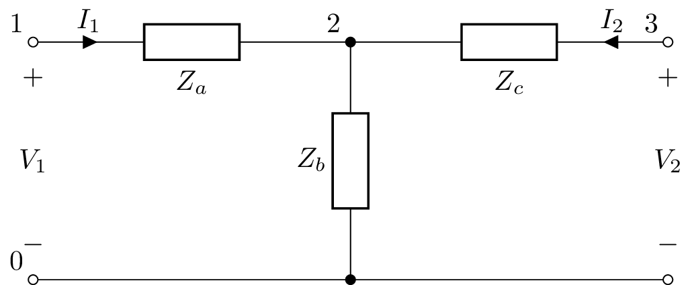

### 5.2 Cuadripolo en π

Topología π (3 impedancias: dos derivaciones en los puertos y una
serie central).

**[`18_cuadripolo_pi.sch`](../examples/18_cuadripolo_pi.sch)**
```
P1 1 0_1; down, v_=V_1
W 1 2; right=0.5
Z1 2 0_2; down, l=Z_a
Z2 2 3; right=2, i>^=I_2, l=Z_b
Z3 3 0_3; down, l=Z_c
W 3 4; right=0.5
P2 4 0_4; down, v=V_2
W 0_1 0_2; right=0.5
W 0_2 0_3; right=2
W 0_3 0_4; right=0.5
; draw_nodes=connections, label_nodes=primary
```

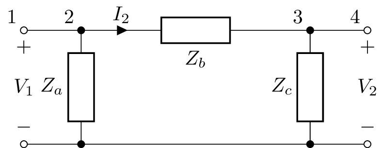

---

## 6. Acoplamiento magnético

### 6.1 Transformador ideal

Fuente ac → R en serie → primario del transformador → carga.
Anotamos relación de espiras `N₁ : N₂` con `l=`.

**[`07_transformador.sch`](../examples/07_transformador.sch)**
```
V1 1 0_1 ac; down
R1 1 2; right
W 2 3; right=0.5
TF 3 0_3 4 0_4; right, l={N_1:N_2}
W 4 5; right=0.5
R2 5 0_5; down
W 0_1 0_3; right
W 0_3 0_4; right
W 0_4 0_5; right
; draw_nodes=connections, label_ids=False
```

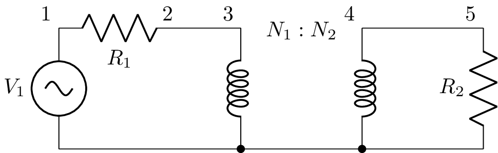

### 6.2 Transformador real

Modelo extendido: resistencias de devanado `R_1`, `R_2` y
inductancias de fuga `L_{d1}`, `L_{d2}` a ambos lados del
transformador ideal.

**[`21_transformador_real.sch`](../examples/21_transformador_real.sch)**
```
V1 1 0_1 ac; down
R_1 1 2; right, l=R_1
L_d1 2 3; right, l=L_{d1}
W 3 4; right=0.5
TF 4 0_4 5 0_5; right, l={N_1:N_2}
W 5 6; right=0.5
L_d2 6 7; right, l=L_{d2}
R_2 7 8; right, l=R_2
W 8 9; right=0.5
R_L 9 0_9; down, l=R_L
W 0_1 0_4; right
W 0_4 0_5; right
W 0_5 0_9; right
; draw_nodes=connections, label_ids=False
```

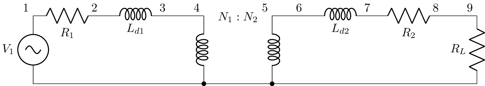

---

## 7. Fuentes controladas

Modeladas como rombos con símbolo de la magnitud que entregan
(`+/−` para tensión, flecha para corriente). El control se
nombra por el componente que mide la corriente (`Vname` o tensión
entre dos nodos).

### 7.1 VCCS (G)

Fuente de corriente controlada por tensión `i = G · v_in`. Ejemplo
de modelo de pequeña señal: el VCCS `G1` se alimenta de `v_in`
medido en `R_{in}`.

**[`12_fuente_VCCS.sch`](../examples/12_fuente_VCCS.sch)**
```
V1 1 0_1; down
R1 1 2 R_s; right=1.5
C1 2 0; down, v=v_C
W 0_1 0; right
W 0 0_2; right
R2 2_2 0_2 R_{in}; down, v=v_{in}
W 2 2_2; right
G1 3 0_3 2_2 0 G; down, l=G v_{in}
R3 3 4 R_{out}; right=1.5
R4 4 0_4 R_L; down
W 0_2 0_3; size=1.2
W 0_3 0_4
P1 4 0_4; down
; label_ids=False, draw_nodes=connections, label_nodes=False
```

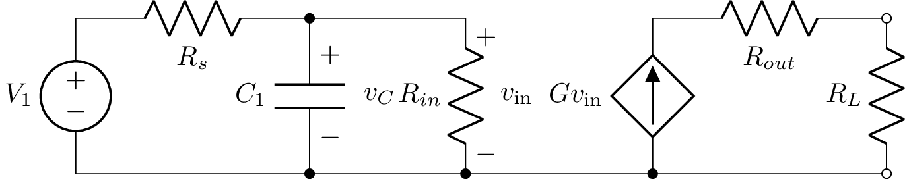

### 7.2 CCCS (F)

Fuente de corriente controlada por corriente `i = F · i_{in}`. La
corriente de control se mide por la fuente `V1`.

**[`13_fuente_CCCS.sch`](../examples/13_fuente_CCCS.sch)**
```
V1 1 0_1; down
R1 1 2 R_s; right=1.5
C1 2 0; down, v=v_C
W 0_1 0; right
W 0 0_2; right
R2 2_2 0_2 R_{in}; down, v=v_{in}
W 2 2_2; right
F1 3 0_3 V1 F; down, l=F i_{in}
R3 3 4 R_{out}; right=1.5
R4 4 0_4 R_L; down
W 0_2 0_3; size=1.2
W 0_3 0_4
P1 4 0_4; down
; label_ids=False, draw_nodes=connections, label_nodes=False
```


---

## 8. Op-amps

El op-amp se modela como una VCVS con `kind=opamp` en una `E`. Los
4 nodos son: salida, referencia, entrada `+`, entrada `−`.

### 8.1 Inversor

`v_o = -(R_2/R_1) v_i`.

**[`08_opamp_inversor.sch`](../examples/08_opamp_inversor.sch)**
```
P1 1 0_1; down
R1 1 2; right
R2 2_1 3_1; right
E1 3_2 0_3 opamp 2_0 2 A; mirror
W 0_1 0; right
W 2_0 0; down
W 3_2 3; right
W 0 0_3; right
P2 3 0_3; down
W 2_1 2; down
W 3_1 3_2; down
; draw_nodes=connections
```

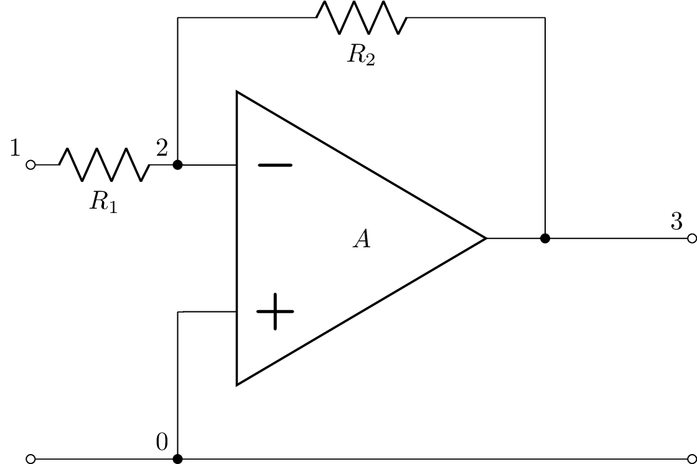

### 8.2 No inversor

`v_o = (1 + R_2/R_1) v_i`.

**[`14_opamp_no_inversor.sch`](../examples/14_opamp_no_inversor.sch)**
```
P1 1 0_1; down
W 2_1 2; down
R1 2 0; down
R2 2 3_1; right
W 3_2 3_1; down
E1 3_2 0_3 opamp 1_1 2_1 A;
W 0_1 0; right
W 3_2 3; right
W 0 0_3; right
P2 3 0_3; down
W 1 1_1; right
; draw_nodes=connections
```

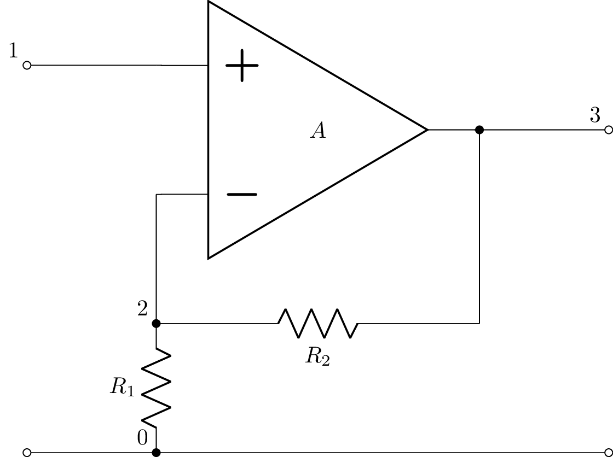

### 8.3 Integrador

`v_o = -(1/RC) ∫ v_i dt`. Capacitor en la rama de realimentación.

**[`15_opamp_integrador.sch`](../examples/15_opamp_integrador.sch)**
```
P1 1 0_1; down
R 1 2; right
C 2_1 3_1; right
E1 3_2 0_3 opamp 2_0 2 A; mirror
W 0_1 0; right
W 2_0 0; down
W 3_2 3; right
W 0 0_3; right
P2 3 0_3; down
W 2_1 2; down
W 3_1 3_2; down
; draw_nodes=connections
```

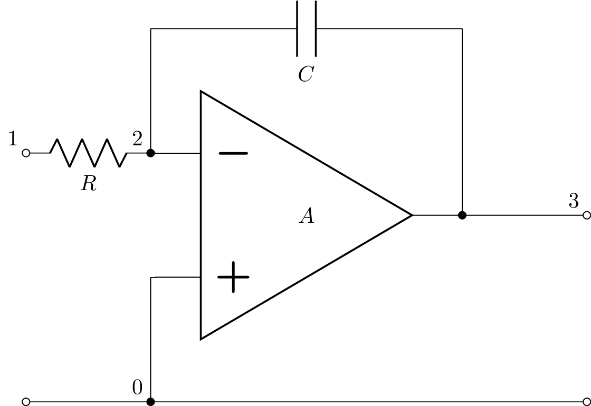

### 8.4 Derivador

`v_o = -RC dv_i/dt`. Capacitor a la entrada, resistor en
realimentación (dual del integrador).

**[`16_opamp_derivador.sch`](../examples/16_opamp_derivador.sch)**
```
P1 1 0_1; down
C 1 2; right
R 2_1 3_1; right
E1 3_2 0_3 opamp 2_0 2 A; mirror
W 0_1 0; right
W 2_0 0; down
W 3_2 3; right
W 0 0_3; right
P2 3 0_3; down
W 2_1 2; down
W 3_1 3_2; down
; draw_nodes=connections
```

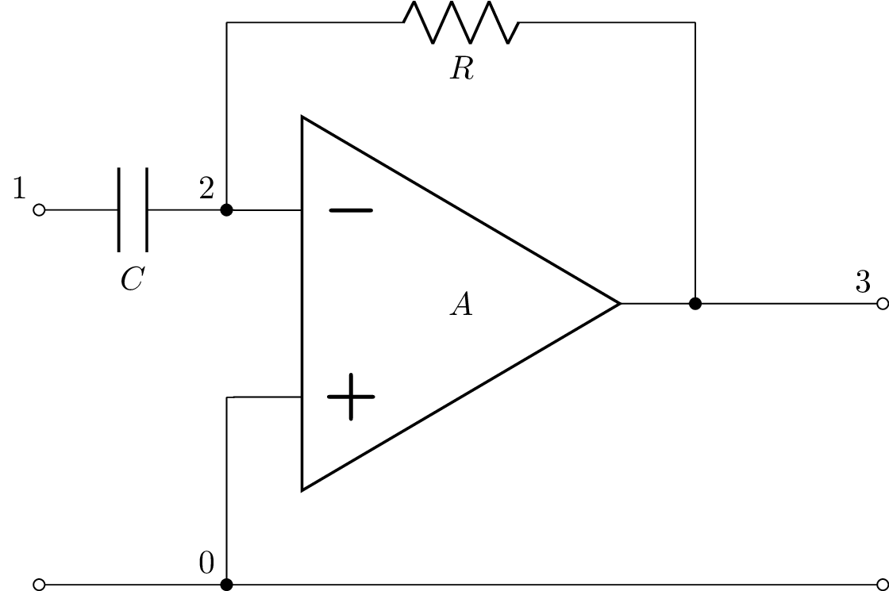

---

## 9. Filtros pasivos

### 9.1 RC pasa-bajo

Transferencia `V_o / V_i = 1 / (1 + sRC)`. Polo en `s = -1/RC`.

**[`19_filtro_RC_pasabajo.sch`](../examples/19_filtro_RC_pasabajo.sch)**
```
P1 1 0_1; down, v_=V_i
R 1 2; right=2, l=R
W 2 3; right=0.5
P2 3 0_3; down, v=V_o
C 2 0_2; down, l=C
W 0_1 0_2; right=2
W 0_2 0_3; right=0.5
; draw_nodes=connections, label_nodes=none
```

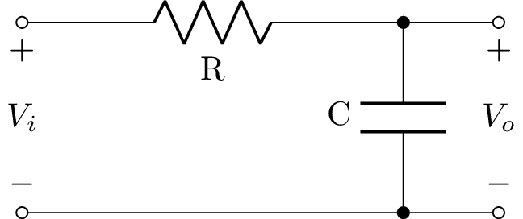

### 9.2 CR pasa-alto

Transferencia `V_o / V_i = sRC / (1 + sRC)`. Cero en el origen.

**[`20_filtro_CR_pasaalto.sch`](../examples/20_filtro_CR_pasaalto.sch)**
```
P1 1 0_1; down, v_=V_i
C 1 2; right=2, l=C
W 2 3; right=0.5
P2 3 0_3; down, v=V_o
R 2 0_2; down, l=R
W 0_1 0_2; right=2
W 0_2 0_3; right=0.5
; draw_nodes=connections, label_nodes=none
```

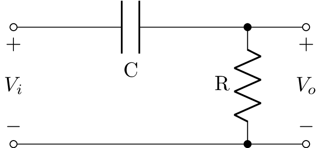

---

## Cómo regenerar la galería

```bash
cd netlist2tikz
source .venv/bin/activate
python examples/render.py
```

Cada `.sch` produce un `.pdf` y un `.png` en `examples/` con el
mismo nombre base. Para agregar un ejemplo nuevo, crear un archivo
`.sch` y volver a correr `render.py`.
