# Curriculares del autor (loop-safe, convenciones propias)

Tema `00_curricular` · **36** ejemplos. Espejados de lcapy (LGPL). Buscá por tag con `rg -l "n2t-tags:.*<tag>" sch/00_curricular/`.

> Curricular: **Teoría de Circuitos II**

| ejemplo | componentes | tags | vista |
|---|---|---|---|
| [01-resistor-simple](sch/00_curricular/01_resistor_simple.sch) · 01 resistor simple | r | curricular-base |  |
| [02-divisor-resistivo](sch/00_curricular/02_divisor_resistivo.sch) · 02 divisor resistivo | r,v,w | curricular-base, visibilidad-nodos |  |
| [03-rc-transitorio](sch/00_curricular/03_rc_transitorio.sch) · 03 rc transitorio | c,r,v,w | curricular-base |  |
| [04-rlc-serie](sch/00_curricular/04_rlc_serie.sch) · 04 rlc serie | c,l,r,v,w | curricular-base, visibilidad-nodos |  |
| [05-rl-con-switch](sch/00_curricular/05_rl_con_switch.sch) · 05 rl con switch | l,r,v,w | curricular-base, visibilidad-nodos |  |
| [06-cuadripolo](sch/00_curricular/06_cuadripolo.sch) · 06 cuadripolo | p,r,w | curricular-base, etiqueta-i, etiqueta-v, visibilidad-nodos |  |
| [07-transformador](sch/00_curricular/07_transformador.sch) · 07 transformador | r,tf,v,w | curricular-base, etiqueta, etiquetas-globales, visibilidad-nodos |  |
| [08-opamp-inversor](sch/00_curricular/08_opamp_inversor.sch) · 08 opamp inversor | e,p,r,w | curricular-base, espejo, visibilidad-nodos |  |
| [09-impedancia-generica](sch/00_curricular/09_impedancia_generica.sch) · 09 impedancia generica | c,r,v,w,z | curricular-base, etiqueta, visibilidad-nodos |  |
| [10-dipolo-thevenin](sch/00_curricular/10_dipolo_thevenin.sch) · 10 dipolo thevenin | p,r,v,w | curricular-base, etiqueta-v, visibilidad-nodos |  |
| [11-resonante-paralelo](sch/00_curricular/11_resonante_paralelo.sch) · 11 resonante paralelo | c,i,l,r,w | curricular-base, visibilidad-nodos |  |
| [14-opamp-no-inversor](sch/00_curricular/14_opamp_no_inversor.sch) · 14 opamp no inversor | e,p,r,w | curricular-base, visibilidad-nodos |  |
| [15-opamp-integrador](sch/00_curricular/15_opamp_integrador.sch) · 15 opamp integrador | c,e,p,r,w | curricular-base, espejo, visibilidad-nodos |  |
| [16-opamp-derivador](sch/00_curricular/16_opamp_derivador.sch) · 16 opamp derivador | c,e,p,r,w | curricular-base, espejo, visibilidad-nodos |  |
| [17-cuadripolo-t](sch/00_curricular/17_cuadripolo_T.sch) · 17 cuadripolo T | p,w,z | curricular-base, etiqueta, etiqueta-i, etiqueta-v, visibilidad-nodos |  |
| [18-cuadripolo-pi](sch/00_curricular/18_cuadripolo_pi.sch) · 18 cuadripolo pi | p,w,z | curricular-base, etiqueta, etiqueta-i, etiqueta-v, visibilidad-nodos |  |
| [19-filtro-rc-pasabajo](sch/00_curricular/19_filtro_RC_pasabajo.sch) · 19 filtro RC pasabajo | c,p,r,w | curricular-base, etiqueta, etiqueta-v, visibilidad-nodos |  |
| [20-filtro-cr-pasaalto](sch/00_curricular/20_filtro_CR_pasaalto.sch) · 20 filtro CR pasaalto | c,p,r,w | curricular-base, etiqueta, etiqueta-v, visibilidad-nodos |  |
| [21-transformador-real](sch/00_curricular/21_transformador_real.sch) · 21 transformador real | l,r,tf,v,w | curricular-base, etiqueta, etiquetas-globales, visibilidad-nodos |  |
| [22-cuadripolo-caja-negra](sch/00_curricular/22_cuadripolo_caja_negra.sch) · 22 cuadripolo caja negra | p,tp,w | curricular-base, etiqueta, etiqueta-i, etiqueta-v, visibilidad-nodos |  |
| [tp4-ej01-bloques](sch/00_curricular/tp4_ej01_bloques.sch) · Tp4 ej01 bloques | r,tp,v,w | curricular-base, estilo, etiqueta | 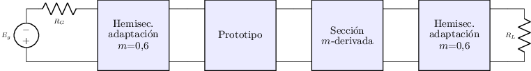 |
| [tp4-ej02-proto-pb](sch/00_curricular/tp4_ej02_proto_pb.sch) · Tp4 ej02 proto pb | c,l,w | curricular-base, etiqueta | 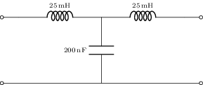 |
| [tp4-ej03-proto-norm](sch/00_curricular/tp4_ej03_proto_norm.sch) · Tp4 ej03 proto norm | c,l,w | curricular-base, etiqueta | 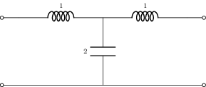 |
| [tp4-ej04-mderiv-pb](sch/00_curricular/tp4_ej04_mderiv_pb.sch) · Tp4 ej04 mderiv pb | c,l,w | curricular-base, etiqueta | 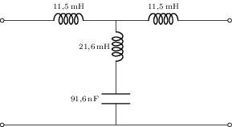 |
| [tp4-ej05-hemi-pb](sch/00_curricular/tp4_ej05_hemi_pb.sch) · Tp4 ej05 hemi pb | c,l,w | curricular-base, etiqueta | 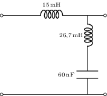 |
| [tp4-ej06a-proto-pa](sch/00_curricular/tp4_ej06a_proto_pa.sch) · Tp4 ej06a proto pa | c,l,w | curricular-base, etiqueta | 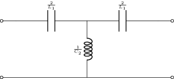 |
| [tp4-ej06b-proto-pbanda](sch/00_curricular/tp4_ej06b_proto_pbanda.sch) · Tp4 ej06b proto pbanda | c,l,w | curricular-base, etiqueta, layout | 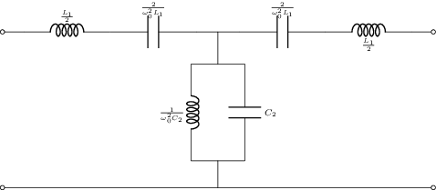 |
| [tp4-ej07-enunciado](sch/00_curricular/tp4_ej07_enunciado.sch) · Tp4 ej07 enunciado | c,l,w | curricular-base, etiqueta | 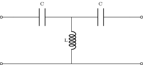 |
| [tp4-ej07-sol](sch/00_curricular/tp4_ej07_sol.sch) · Tp4 ej07 sol | c,l,w | curricular-base, etiqueta | 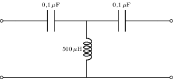 |
| [tp4-ej08-enunciado](sch/00_curricular/tp4_ej08_enunciado.sch) · Tp4 ej08 enunciado | c,l,w | curricular-base, etiqueta | 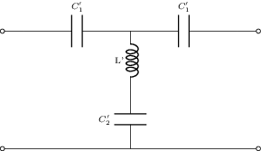 |
| [tp4-ej08-hemi-pa](sch/00_curricular/tp4_ej08_hemi_pa.sch) · Tp4 ej08 hemi pa | c,l,w | curricular-base, etiqueta | 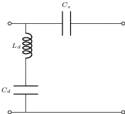 |
| [tp4-ej09-hemi](sch/00_curricular/tp4_ej09_hemi.sch) · Tp4 ej09 hemi | c,l,w | curricular-base, etiqueta, layout | 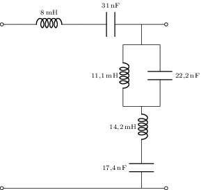 |
| [tp4-ej09-mderiv](sch/00_curricular/tp4_ej09_mderiv.sch) · Tp4 ej09 mderiv | c,l,w | curricular-base, etiqueta, layout | 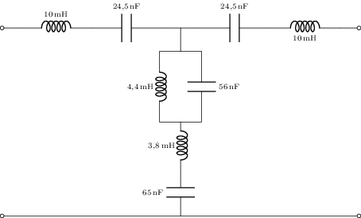 |
| [tp4-ej09-proto](sch/00_curricular/tp4_ej09_proto.sch) · Tp4 ej09 proto | c,l,w | curricular-base, etiqueta, layout | 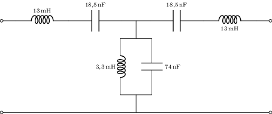 |
| [tp4-ej10-mderiv](sch/00_curricular/tp4_ej10_mderiv.sch) · Tp4 ej10 mderiv | c,l,w | curricular-base, etiqueta, layout | 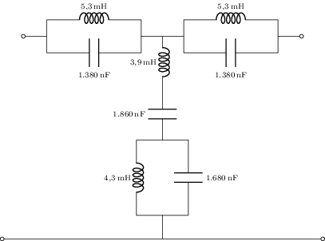 |
| [tp4-ej10-proto](sch/00_curricular/tp4_ej10_proto.sch) · Tp4 ej10 proto | c,l,w | curricular-base, etiqueta, layout | 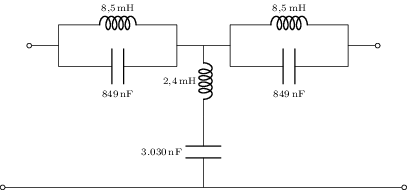 |
