# Curriculares del autor (loop-safe, convenciones propias)

Tema `00_curricular` · **20** ejemplos. Espejados de lcapy (LGPL). Buscá por tag con `rg -l "n2t-tags:.*<tag>" sch/00_curricular/`.

> Curricular: **Teoría de Circuitos II**

| ejemplo | componentes | tags | vista |
|---|---|---|---|
| [01-resistor-simple](sch/00_curricular/01_resistor_simple.sch) · 01 resistor simple | r | curricular-base | 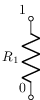 |
| [02-divisor-resistivo](sch/00_curricular/02_divisor_resistivo.sch) · 02 divisor resistivo | r,v,w | curricular-base, visibilidad-nodos | 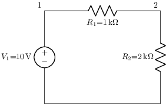 |
| [03-rc-transitorio](sch/00_curricular/03_rc_transitorio.sch) · 03 rc transitorio | c,r,v,w | curricular-base |  |
| [04-rlc-serie](sch/00_curricular/04_rlc_serie.sch) · 04 rlc serie | c,l,r,v,w | curricular-base, visibilidad-nodos | 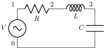 |
| [05-rl-con-switch](sch/00_curricular/05_rl_con_switch.sch) · 05 rl con switch | l,r,v,w | curricular-base, visibilidad-nodos | 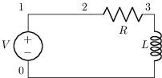 |
| [06-cuadripolo](sch/00_curricular/06_cuadripolo.sch) · 06 cuadripolo | p,r,w | curricular-base, etiqueta-i, etiqueta-v, visibilidad-nodos |  |
| [07-transformador](sch/00_curricular/07_transformador.sch) · 07 transformador | r,tf,v,w | curricular-base, etiqueta, etiquetas-globales, visibilidad-nodos | 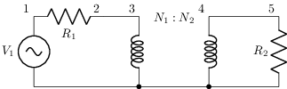 |
| [08-opamp-inversor](sch/00_curricular/08_opamp_inversor.sch) · 08 opamp inversor | e,p,r,w | curricular-base, espejo, visibilidad-nodos |  |
| [09-impedancia-generica](sch/00_curricular/09_impedancia_generica.sch) · 09 impedancia generica | c,r,v,w,z | curricular-base, etiqueta, visibilidad-nodos | 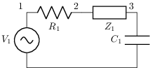 |
| [10-dipolo-thevenin](sch/00_curricular/10_dipolo_thevenin.sch) · 10 dipolo thevenin | p,r,v,w | curricular-base, etiqueta-v, visibilidad-nodos | 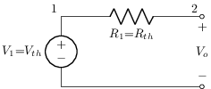 |
| [11-resonante-paralelo](sch/00_curricular/11_resonante_paralelo.sch) · 11 resonante paralelo | c,i,l,r,w | curricular-base, visibilidad-nodos | 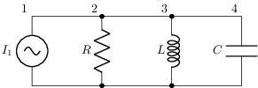 |
| [14-opamp-no-inversor](sch/00_curricular/14_opamp_no_inversor.sch) · 14 opamp no inversor | e,p,r,w | curricular-base, visibilidad-nodos | 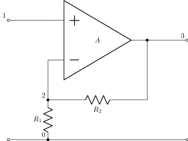 |
| [15-opamp-integrador](sch/00_curricular/15_opamp_integrador.sch) · 15 opamp integrador | c,e,p,r,w | curricular-base, espejo, visibilidad-nodos | 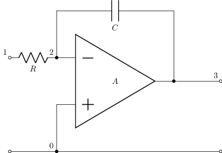 |
| [16-opamp-derivador](sch/00_curricular/16_opamp_derivador.sch) · 16 opamp derivador | c,e,p,r,w | curricular-base, espejo, visibilidad-nodos | 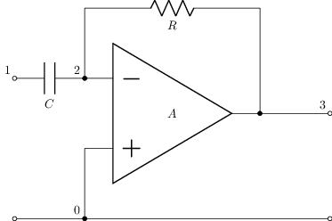 |
| [17-cuadripolo-t](sch/00_curricular/17_cuadripolo_T.sch) · 17 cuadripolo T | p,w,z | curricular-base, etiqueta, etiqueta-i, etiqueta-v, visibilidad-nodos | 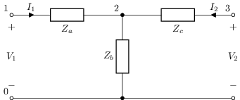 |
| [18-cuadripolo-pi](sch/00_curricular/18_cuadripolo_pi.sch) · 18 cuadripolo pi | p,w,z | curricular-base, etiqueta, etiqueta-i, etiqueta-v, visibilidad-nodos | 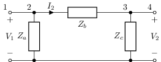 |
| [19-filtro-rc-pasabajo](sch/00_curricular/19_filtro_RC_pasabajo.sch) · 19 filtro RC pasabajo | c,p,r,w | curricular-base, etiqueta, etiqueta-v, visibilidad-nodos | 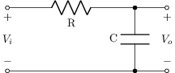 |
| [20-filtro-cr-pasaalto](sch/00_curricular/20_filtro_CR_pasaalto.sch) · 20 filtro CR pasaalto | c,p,r,w | curricular-base, etiqueta, etiqueta-v, visibilidad-nodos | 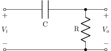 |
| [21-transformador-real](sch/00_curricular/21_transformador_real.sch) · 21 transformador real | l,r,tf,v,w | curricular-base, etiqueta, etiquetas-globales, visibilidad-nodos | 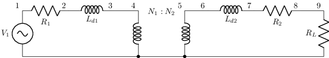 |
| [22-cuadripolo-caja-negra](sch/00_curricular/22_cuadripolo_caja_negra.sch) · 22 cuadripolo caja negra | p,tp,w | curricular-base, etiqueta, etiqueta-i, etiqueta-v, visibilidad-nodos | 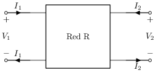 |
