# Pasivos R/L/C, Z/Y, básicos

Tema `01_pasivos` · **40** ejemplos. Espejados de lcapy (LGPL). Buscá por tag con `rg -l "n2t-tags:.*<tag>" sch/01_pasivos/`.

> Curricular: **Teoría de Circuitos II**

| ejemplo | componentes | tags | vista |
|---|---|---|---|
| [c-stamp](sch/01_pasivos/C-stamp.sch) · C stamp | c,p,w | etiqueta-i, etiqueta-v, pasivo, tierra, visibilidad-nodos | 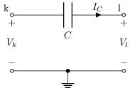 |
| [capacitors](sch/01_pasivos/capacitors.sch) · Capacitors | c | etiqueta, kind, kind:curved, kind:electrolytic, kind:polar, kind:sensor, kind:tunable, kind:variable | 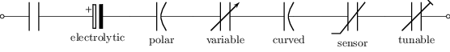 |
| [cpe1](sch/01_pasivos/CPE1.sch) · CPE1 | cpe | pasivo | 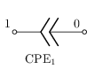 |
| [fb1](sch/01_pasivos/FB1.sch) · FB1 | fb | pasivo | 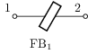 |
| [fb2](sch/01_pasivos/FB2.sch) · FB2 | c,fb | pasivo | 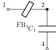 |
| [ferrite-choke1](sch/01_pasivos/ferrite-choke1.sch) · Ferrite choke1 | c,o,r,tf,v,w | estilo, etiqueta, etiqueta-i, kind, layout, pasivo, visibilidad-nodos | 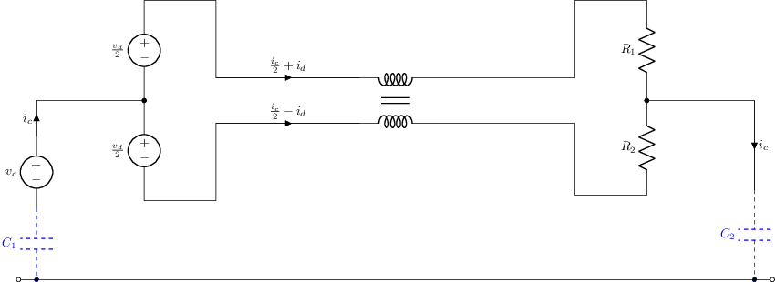 |
| [ferrite-choke2](sch/01_pasivos/ferrite-choke2.sch) · Ferrite choke2 | c,o,r,tf,v,w | estilo, etiqueta, etiqueta-i, kind, layout, pasivo, raw-tikz, tierra | 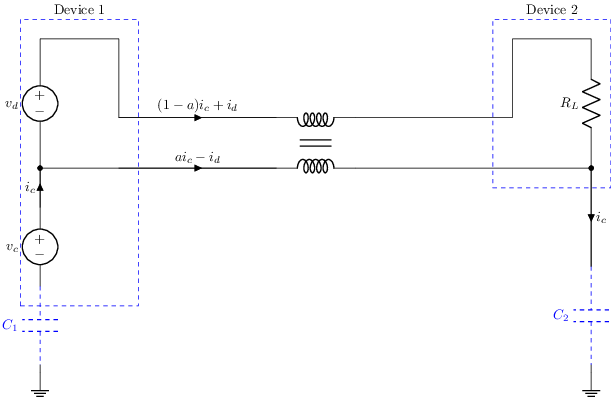 |
| [i-stamp](sch/01_pasivos/I-stamp.sch) · I stamp | i,p,w | etiqueta-v, pasivo, tierra, visibilidad-nodos | 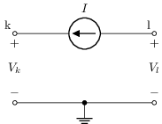 |
| [inductors](sch/01_pasivos/inductors.sch) · Inductors | l | etiqueta, kind, kind:american, kind:choke, kind:european, kind:sensor, kind:tunable, kind:twolineschoke | 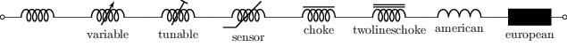 |
| [l-stamp](sch/01_pasivos/L-stamp.sch) · L stamp | l,p,w | etiqueta-i, etiqueta-v, pasivo, tierra, visibilidad-nodos | 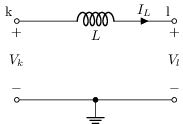 |
| [l1](sch/01_pasivos/L1.sch) · L1 | l | pasivo, raw-tikz | 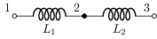 |
| [l2](sch/01_pasivos/L2.sch) · L2 | l | estilo, pasivo | 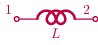 |
| [lc1](sch/01_pasivos/LC1.sch) · LC a tierra | c,l,w | pasivo | 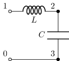 |
| [massspringdamper1](sch/01_pasivos/massspringdamper1.sch) · Massspringdamper1 | mecanico | pasivo | 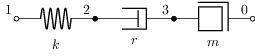 |
| [r-stamp](sch/01_pasivos/R-stamp.sch) · R stamp | p,r,w | etiqueta-i, etiqueta-v, pasivo, tierra, visibilidad-nodos | 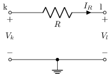 |
| [rc1](sch/01_pasivos/RC1.sch) · RC serie horizontal | c,r | pasivo | 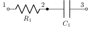 |
| [rc2](sch/01_pasivos/RC2.sch) · R y C en paralelo (par vertical) | c,r,w | pasivo | 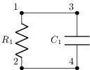 |
| [rcparallel1](sch/01_pasivos/RCparallel1.sch) · RCparallel1 | c,r,w | pasivo | 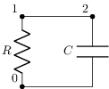 |
| [rcparallel1noisy](sch/01_pasivos/RCparallel1noisy.sch) · RCparallel1noisy | c,r,v,w | pasivo | 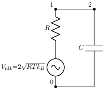 |
| [resistors](sch/01_pasivos/resistors.sch) · Resistencias (variantes) | r | etiqueta, kind, kind:tunable, kind:variable, pasivo, visibilidad-nodos | 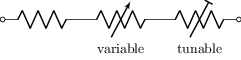 |
| [resistors1](sch/01_pasivos/resistors1.sch) · Resistors1 | r | grilla, pasivo | 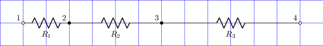 |
| [resistors2](sch/01_pasivos/resistors2.sch) · Resistors2 | r | geometria-global, grilla, pasivo | 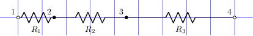 |
| [resistors3](sch/01_pasivos/resistors3.sch) · Resistors3 | r | geometria-global, grilla, pasivo | 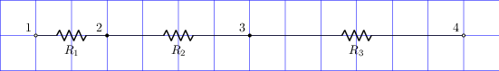 |
| [resistors4](sch/01_pasivos/resistors4.sch) · Resistors4 | r | geometria-global, grilla, pasivo | 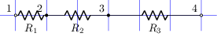 |
| [resistors5](sch/01_pasivos/resistors5.sch) · Resistors5 | r | geometria-global, grilla, pasivo | 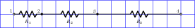 |
| [resistors6](sch/01_pasivos/resistors6.sch) · Resistors6 | r | geometria-global, grilla, pasivo | 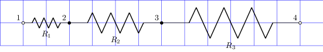 |
| [resistors7](sch/01_pasivos/resistors7.sch) · Resistors7 | r | grilla, pasivo |  |
| [rright](sch/01_pasivos/Rright.sch) · Rright | r | pasivo | 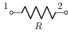 |
| [rright2](sch/01_pasivos/Rright2.sch) · Rright2 | r | pasivo | 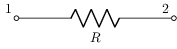 |
| [v-stamp](sch/01_pasivos/V-stamp.sch) · V stamp | p,v,w | etiqueta-i, etiqueta-v, pasivo, tierra, visibilidad-nodos | 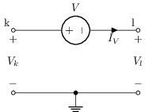 |
| [vacrl1](sch/01_pasivos/VacRL1.sch) · VacRL1 | l,r,v,w | pasivo | 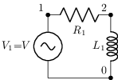 |
| [variable1](sch/01_pasivos/variable1.sch) · Variable1 | c,l,r,v,w | kind, pasivo | 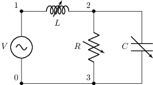 |
| [vilrc](sch/01_pasivos/VILRC.sch) · VILRC | c,i,l,r,v | etiqueta-i, pasivo | 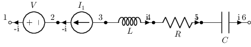 |
| [virlc](sch/01_pasivos/VIRLC.sch) · VIRLC | c,i,l,r,v | etiqueta-i, pasivo | 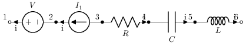 |
| [voltage-divider](sch/01_pasivos/voltage-divider.sch) · Divisor de tensión | p,r,v,w | etiqueta-v, pasivo | 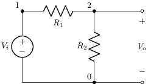 |
| [voltage-divider2](sch/01_pasivos/voltage-divider2.sch) · Divisor de tensión (variante) | p,r,v,w | estilo-simbolo, etiqueta-v, geometria-global, pasivo, visibilidad-nodos | 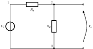 |
| [vrl1](sch/01_pasivos/VRL1.sch) · VRL1 | l,r,v,w | etiqueta, etiqueta-i, etiqueta-v, pasivo | 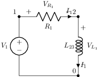 |
| [vrl2](sch/01_pasivos/VRL2.sch) · VRL2 | l,r,v,w | etiqueta-i, etiqueta-v, pasivo | 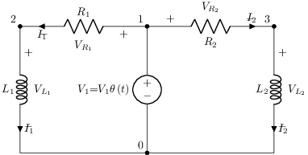 |
| [vrl3](sch/01_pasivos/VRL3.sch) · VRL3 | l,r,v,w | etiqueta-i, etiqueta-v, pasivo | 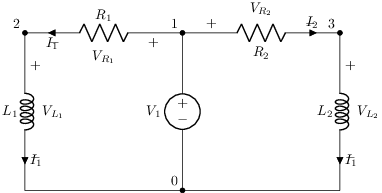 |
| [vrl4](sch/01_pasivos/VRL4.sch) · VRL4 | l,r,v,w | etiqueta-i, etiqueta-v, pasivo | 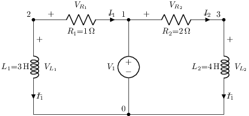 |
