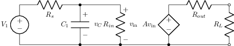
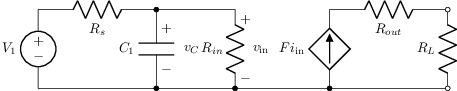
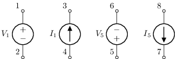
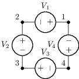
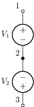
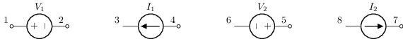

# Fuentes independientes y controladas

Tema `02_fuentes` · **8** ejemplos. Espejados de lcapy (LGPL). Buscá por tag con `rg -l "n2t-tags:.*<tag>" sch/02_fuentes/`.

> Curricular: **Teoría de Circuitos II**

| ejemplo | componentes | tags | vista |
|---|---|---|---|
| [e1](sch/02_fuentes/E1.sch) · E1 | c,e,p,r,v,w | etiqueta, etiqueta-v, etiquetas-globales, fuente, visibilidad-nodos |  |
| [f1](sch/02_fuentes/F1.sch) · F1 | c,f,p,r,v,w | etiqueta, etiqueta-v, etiquetas-globales, fuente, visibilidad-nodos |  |
| [g1](sch/02_fuentes/G1.sch) · G1 | c,g,p,r,v,w | etiqueta, etiqueta-v, etiquetas-globales, fuente, visibilidad-nodos |  |
| [h1](sch/02_fuentes/H1.sch) · H1 | c,h,p,r,v,w | etiqueta, etiqueta-v, etiquetas-globales, fuente, visibilidad-nodos |  |
| [hsources](sch/02_fuentes/hsources.sch) · Hsources | i,o,v | fuente |  |
| [v5](sch/02_fuentes/V5.sch) · V5 | v | fuente |  |
| [voltage-sources](sch/02_fuentes/voltage_sources.sch) · Voltage sources | v | fuente |  |
| [vsources](sch/02_fuentes/vsources.sch) · Vsources | i,o,v | fuente |  |
