# Diodos

Tema `03_diodos` · **12** ejemplos. Espejados de lcapy (LGPL). Buscá por tag con `rg -l "n2t-tags:.*<tag>" sch/03_diodos/`.

| ejemplo | componentes | tags | vista |
|---|---|---|---|
| [d1](sch/03_diodos/D1.sch) · D1 | d,r | diodo | 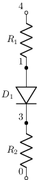 |
| [d2](sch/03_diodos/D2.sch) · D2 | d,r | diodo, espejo | 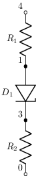 |
| [d3](sch/03_diodos/D3.sch) · D3 | d | diodo, espejo | 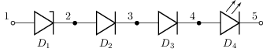 |
| [d4](sch/03_diodos/D4.sch) · D4 | d | diodo | 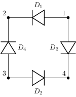 |
| [d5](sch/03_diodos/D5.sch) · D5 | d | diodo | 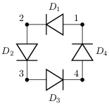 |
| [dbridge](sch/03_diodos/Dbridge.sch) · Dbridge | d | diodo, rotacion | 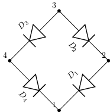 |
| [ddown](sch/03_diodos/Ddown.sch) · Ddown | d | diodo | 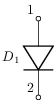 |
| [diodes](sch/03_diodos/diodes.sch) · Tipos de diodo | d | diodo, etiqueta, kind, kind:bidirectional, kind:laser, kind:led, kind:photo, kind:schottky | 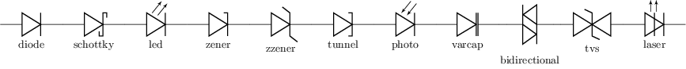 |
| [diodes2](sch/03_diodos/diodes2.sch) · Diodes2 | d | diodo, estilo-simbolo, etiqueta, visibilidad-nodos | 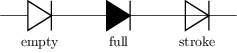 |
| [dleft](sch/03_diodos/Dleft.sch) · Dleft | d | diodo | 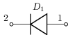 |
| [dright](sch/03_diodos/Dright.sch) · Dright | d | diodo | 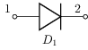 |
| [dup](sch/03_diodos/Dup.sch) · Dup | d | diodo | 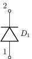 |
