# Transistores BJT/MOSFET/JFET

Tema `04_transistores` · **36** ejemplos. Espejados de lcapy (LGPL). Buscá por tag con `rg -l "n2t-tags:.*<tag>" sch/04_transistores/`.

| ejemplo | componentes | tags | vista |
|---|---|---|---|
| [accelerometer1](sch/04_transistores/accelerometer1.sch) · Accelerometer1 | c,l,p,r,tf,w | estilo, etiqueta-i, etiqueta-v, layout, transistor, visibilidad-nodos | 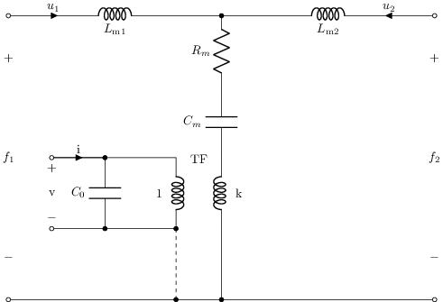 |
| [amp](sch/04_transistores/amp.sch) · Amp | e | grilla, transistor | 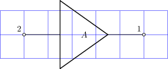 |
| [cmos-c-load-thevenin](sch/04_transistores/cmos_C_load_thevenin.sch) · Cmos C load thevenin | c,p,r,u,v,w | estilo, etiqueta, etiqueta-i, etiqueta-v, transistor, visibilidad-nodos | 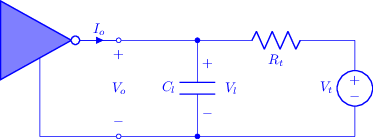 |
| [cmos-ibis-r-series-c-load-thevenin](sch/04_transistores/cmos_ibis_R_series_C_load_thevenin.sch) · Cmos ibis R series C load thevenin | c,i,l,r,v,w | transistor | 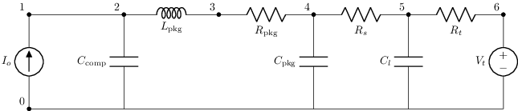 |
| [cmos-r-series-c-load-thevenin](sch/04_transistores/cmos_R_series_C_load_thevenin.sch) · Cmos R series C load thevenin | c,p,r,u,v,w | estilo, etiqueta, etiqueta-i, etiqueta-v, transistor, visibilidad-nodos | 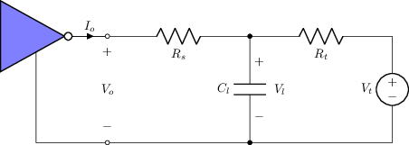 |
| [common-base](sch/04_transistores/common-base.sch) · Common base | p,q,r,w | transistor | 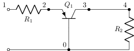 |
| [j1](sch/04_transistores/J1.sch) · J1 | j,r | transistor | 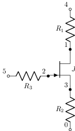 |
| [j2](sch/04_transistores/J2.sch) · J2 | j,r | transistor | 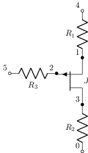 |
| [j3](sch/04_transistores/J3.sch) · J3 | j,r | transistor |  |
| [m1](sch/04_transistores/M1.sch) · M1 | m,r | transistor | 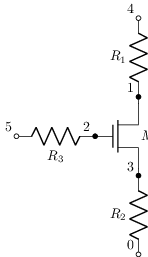 |
| [m1b](sch/04_transistores/M1b.sch) · M1b | m | transistor | 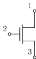 |
| [m1c](sch/04_transistores/M1c.sch) · M1c | m,p | transistor |  |
| [m2](sch/04_transistores/M2.sch) · M2 | m,r | transistor |  |
| [m3](sch/04_transistores/M3.sch) · M3 | m,r | transistor | 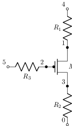 |
| [m6](sch/04_transistores/M6.sch) · M6 | m,r | transistor | 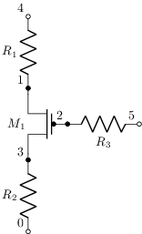 |
| [mosfet-push-pull-load](sch/04_transistores/mosfet_push_pull_load.sch) · Mosfet push pull load | m,p,r,v,w | etiqueta, etiqueta-f, etiqueta-v, kind, kind:nfet, kind:pfet, tierra, transistor | 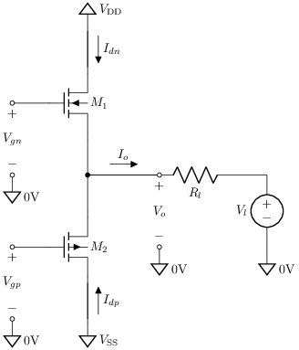 |
| [nmosfet-simple-amplifier](sch/04_transistores/nmosfet_simple_amplifier.sch) · Nmosfet simple amplifier | m,p,r,v,w | etiqueta, etiqueta-f, etiqueta-v, kind, kind:nfet, tierra, transistor, visibilidad-nodos | 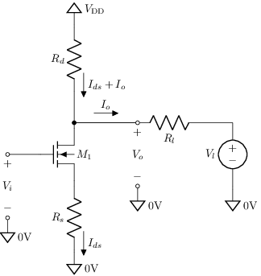 |
| [q1](sch/04_transistores/Q1.sch) · Q1 | q,r | transistor | 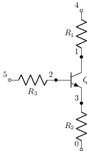 |
| [q1b](sch/04_transistores/Q1b.sch) · Q1b | q | transistor |  |
| [q1c](sch/04_transistores/Q1c.sch) · Q1c | p,q | transistor |  |
| [q2](sch/04_transistores/Q2.sch) · Q2 | q,r | transistor | 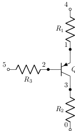 |
| [q3](sch/04_transistores/Q3.sch) · Q3 | q | transistor | 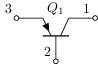 |
| [qnpndown](sch/04_transistores/Qnpndown.sch) · Qnpndown | q | transistor | 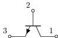 |
| [qnpnleft](sch/04_transistores/Qnpnleft.sch) · Qnpnleft | q | transistor | 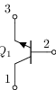 |
| [qnpnright](sch/04_transistores/Qnpnright.sch) · Qnpnright | q | transistor | 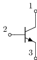 |
| [qnpnrot45](sch/04_transistores/Qnpnrot45.sch) · Qnpnrot45 | q | rotacion, transistor | 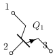 |
| [qnpnup](sch/04_transistores/Qnpnup.sch) · Qnpnup | q | transistor | 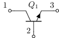 |
| [qpnpdown](sch/04_transistores/Qpnpdown.sch) · Qpnpdown | q | transistor | 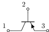 |
| [qpnpleft](sch/04_transistores/Qpnpleft.sch) · Qpnpleft | q | transistor | 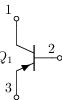 |
| [qpnpright](sch/04_transistores/Qpnpright.sch) · Qpnpright | q | transistor | 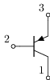 |
| [qpnpup](sch/04_transistores/Qpnpup.sch) · Qpnpup | q | transistor |  |
| [totem](sch/04_transistores/totem.sch) · Totem | q | transistor | 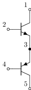 |
| [transistors](sch/04_transistores/transistors.sch) · Tipos de transistor | j,m,o,q | etiqueta, kind, kind:nfet, kind:nfetd, kind:nigfetd, kind:nigfete, kind:nigfetebulk, kind:nmos | 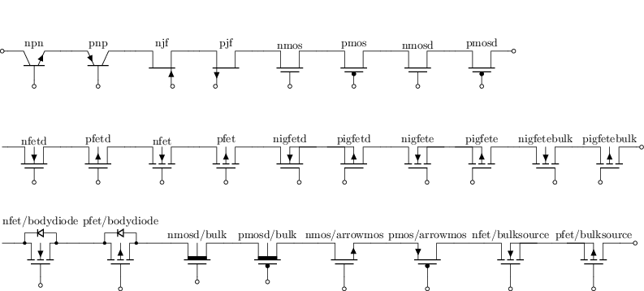 |
| [transistors1](sch/04_transistores/transistors1.sch) · Transistors1 | q | transistor | 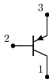 |
| [transistors2](sch/04_transistores/transistors2.sch) · Transistors2 | o,q | espejo, transistor | 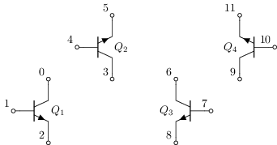 |
| [transistors3](sch/04_transistores/transistors3.sch) · Transistors3 | m | kind, kind:nfet, transistor | 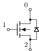 |
