# Amplificadores operacionales

Tema `05_opamps` · **69** ejemplos. Espejados de lcapy (LGPL). Buscá por tag con `rg -l "n2t-tags:.*<tag>" sch/05_opamps/`.

> Curricular: **Teoría de Circuitos II**

| ejemplo | componentes | tags | vista |
|---|---|---|---|
| [diffamp1](sch/05_opamps/diffamp1.sch) · Diffamp1 | u | grilla, opamp, pines |  |
| [eopamp-mirror](sch/05_opamps/Eopamp_mirror.sch) · Eopamp mirror | e,o | espejo, grilla, opamp | 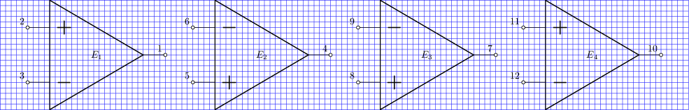 |
| [eopamp-uopamp](sch/05_opamps/Eopamp_Uopamp.sch) · Eopamp Uopamp | e,o,u | grilla, opamp, pines | 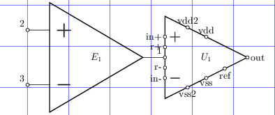 |
| [fdopamp-amplifier1](sch/05_opamps/fdopamp-amplifier1.sch) · Fdopamp amplifier1 | e,p,r,v,w | espejo, etiqueta, opamp, tierra, visibilidad-nodos | 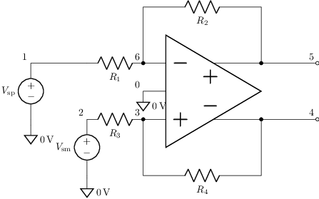 |
| [fdopamp-test1](sch/05_opamps/fdopamp-test1.sch) · Fdopamp test1 | e | grilla, opamp, visibilidad-nodos | 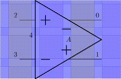 |
| [fdopamp1](sch/05_opamps/fdopamp1.sch) · Fdopamp1 | e | etiqueta, opamp, visibilidad-nodos | 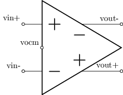 |
| [fdopamp1](sch/05_opamps/fdopamp1__1.sch) · Fdopamp1 | e | grilla, opamp | 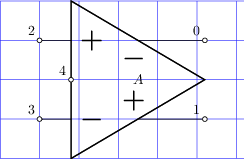 |
| [fdopamp2](sch/05_opamps/fdopamp2.sch) · Fdopamp2 | e | grilla, opamp | 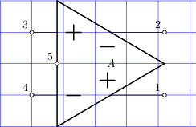 |
| [fdopamp3](sch/05_opamps/fdopamp3.sch) · Fdopamp3 | e,p,r,w | opamp, visibilidad-nodos | 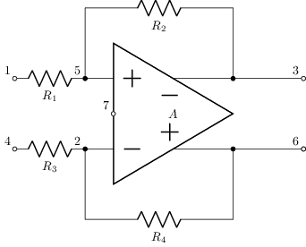 |
| [fdopamp4](sch/05_opamps/fdopamp4.sch) · Fdopamp4 | e,r,w | geometria-global, grilla, opamp | 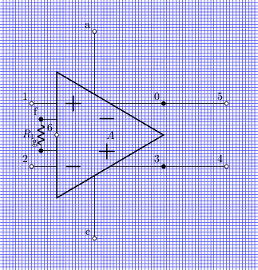 |
| [fdopampright](sch/05_opamps/fdopampright.sch) · Fdopampright | e | opamp | 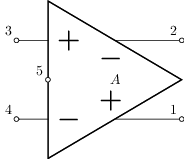 |
| [fdopamps](sch/05_opamps/fdopamps.sch) · Fdopamps | e,o | espejo, opamp, pines, visibilidad-nodos | 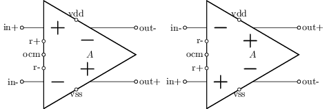 |
| [inamp-amplifier1](sch/05_opamps/inamp-amplifier1.sch) · Inamp amplifier1 | e,r,v,w | etiqueta, geometria-global, opamp, tierra, visibilidad-nodos | 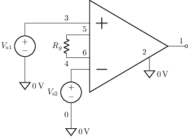 |
| [inamp1](sch/05_opamps/inamp1.sch) · Inamp1 | e,r,w | etiqueta, geometria-global, opamp, tierra, visibilidad-nodos | 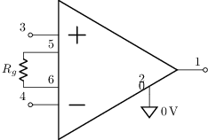 |
| [inamp1](sch/05_opamps/inamp1__1.sch) · Inamp1 | e | grilla, opamp | 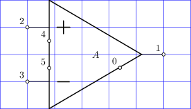 |
| [integrator](sch/05_opamps/integrator.sch) · Integrator | c,e,p,r,v,w | espejo, etiquetas-globales, opamp, visibilidad-nodos | 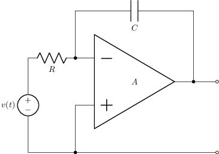 |
| [lpf1-buffer-loaded](sch/05_opamps/lpf1-buffer-loaded.sch) · Lpf1 buffer loaded | c,e,p,r,rel,v,w | etiqueta, etiqueta-v, opamp, visibilidad-nodos | 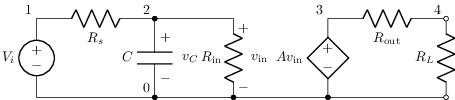 |
| [lpf1-buffer-loaded2](sch/05_opamps/lpf1-buffer-loaded2.sch) · Lpf1 buffer loaded2 | c,e,p,r,rel,v,w | etiqueta, etiqueta-v, opamp, visibilidad-nodos | 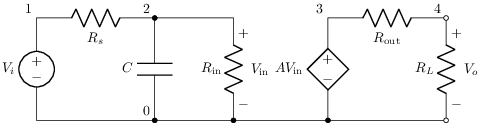 |
| [lpf1-buffer-loaded3](sch/05_opamps/lpf1-buffer-loaded3.sch) · Lpf1 buffer loaded3 | c,e,p,r,rel,v,w | estilo-simbolo, etiqueta, etiqueta-v, opamp | 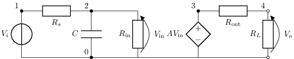 |
| [multiple-feedback-lpf](sch/05_opamps/multiple-feedback-lpf.sch) · Multiple feedback lpf | c,e,p,r,w | espejo, etiqueta, etiquetas-globales, geometria-global, opamp, visibilidad-nodos | 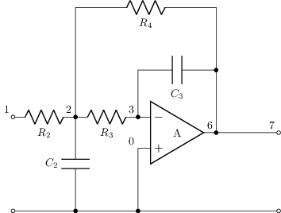 |
| [opamp-differential-amplifier1](sch/05_opamps/opamp-differential-amplifier1.sch) · Opamp differential amplifier1 | e,p,r,w | espejo, opamp, visibilidad-nodos | 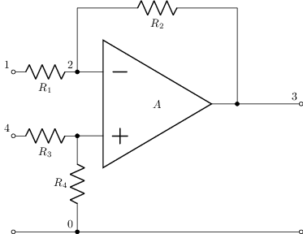 |
| [opamp-displacement-current-sensor-noise-model1](sch/05_opamps/opamp-displacement-current-sensor-noise-model1.sch) · Opamp displacement current sensor noise model1 | c,e,i,p,r,v,w | espejo, opamp, visibilidad-nodos | 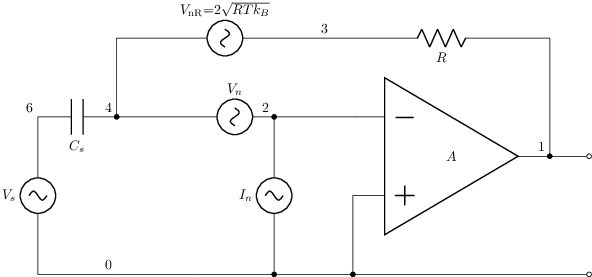 |
| [opamp-displacement-current-sensor1](sch/05_opamps/opamp-displacement-current-sensor1.sch) · Opamp displacement current sensor1 | c,e,p,r,v,w | espejo, etiqueta-v, opamp, visibilidad-nodos | 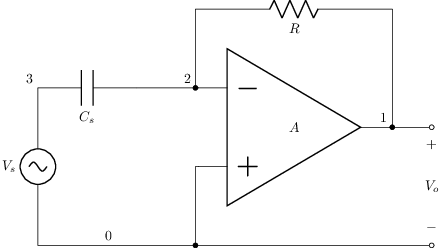 |
| [opamp-inverting-amplifier](sch/05_opamps/opamp-inverting-amplifier.sch) · Opamp inversor | e,p,r,w | espejo, opamp, visibilidad-nodos | 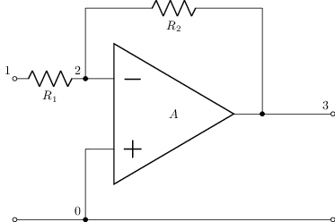 |
| [opamp-inverting-amplifier1](sch/05_opamps/opamp-inverting-amplifier1.sch) · Opamp inverting amplifier1 | e,p,r,v,w | espejo, etiquetas-globales, opamp, visibilidad-nodos | 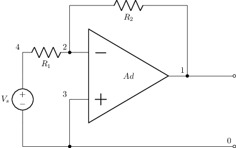 |
| [opamp-inverting-amplifier2](sch/05_opamps/opamp-inverting-amplifier2.sch) · Opamp inverting amplifier2 | e,p,r,w | espejo, geometria-global, opamp, visibilidad-nodos | 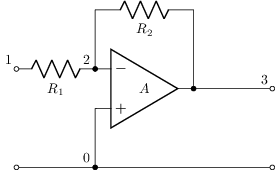 |
| [opamp-inverting-amplifier3](sch/05_opamps/opamp-inverting-amplifier3.sch) · Opamp inverting amplifier3 | e,p,r,w | espejo, geometria-global, opamp, visibilidad-nodos | 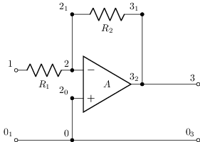 |
| [opamp-inverting-integrator](sch/05_opamps/opamp-inverting-integrator.sch) · Integrador con opamp | c,e,p,r,w | espejo, opamp | 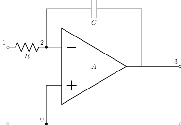 |
| [opamp-inverting2](sch/05_opamps/opamp-inverting2.sch) · Opamp inverting2 | e,p,r,w | espejo, opamp | 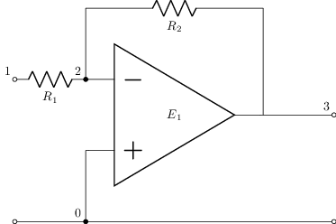 |
| [opamp-noninverting-amplifier](sch/05_opamps/opamp-noninverting-amplifier.sch) · Opamp no inversor | e,i,p,r,v,w | etiqueta, opamp, visibilidad-nodos | 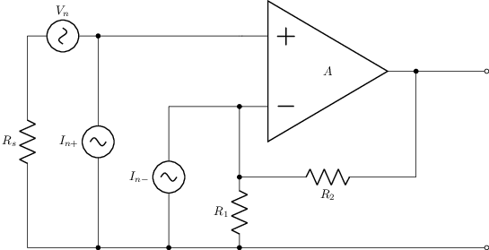 |
| [opamp-noninverting-amplifier](sch/05_opamps/opamp-noninverting-amplifier__1.sch) · Opamp no inversor | e,p,r,w | opamp | 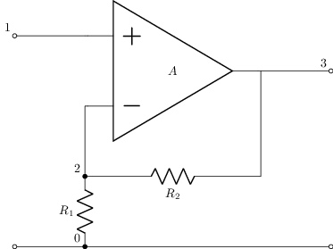 |
| [opamp-noninverting-amplifier-noisy](sch/05_opamps/opamp-noninverting-amplifier-noisy.sch) · Opamp noninverting amplifier noisy | e,i,p,r,v,w | etiqueta, opamp, visibilidad-nodos | 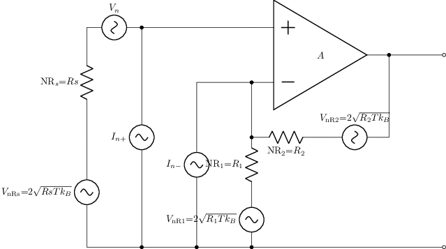 |
| [opamp-noninverting-amplifier1](sch/05_opamps/opamp-noninverting-amplifier1.sch) · Opamp noninverting amplifier1 | e,p,r,v,w | etiquetas-globales, opamp, visibilidad-nodos |  |
| [opamp-noninverting-amplifier2](sch/05_opamps/opamp-noninverting-amplifier2.sch) · Opamp noninverting amplifier2 | e,p,r,v,w | etiquetas-globales, opamp, visibilidad-nodos | 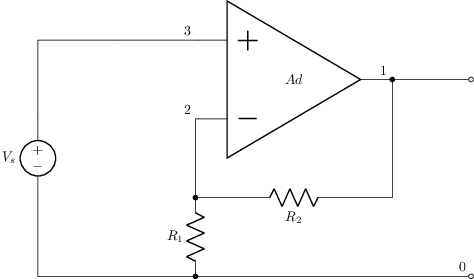 |
| [opamp-piezo-amplifier1](sch/05_opamps/opamp-piezo-amplifier1.sch) · Opamp piezo amplifier1 | c,e,i,p,r,v,w | etiqueta-v, opamp, visibilidad-nodos | 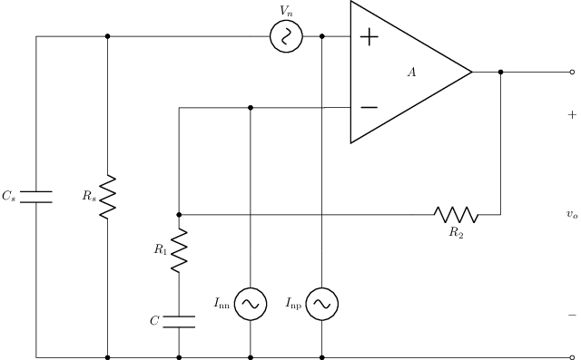 |
| [opamp-piezo-amplifier2](sch/05_opamps/opamp-piezo-amplifier2.sch) · Opamp piezo amplifier2 | c,e,i,p,r,v,w | etiqueta-v, opamp, visibilidad-nodos | 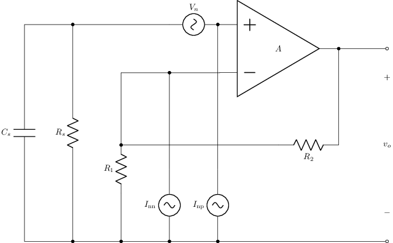 |
| [opamp-test1](sch/05_opamps/opamp-test1.sch) · Opamp test1 | e | grilla, opamp, visibilidad-nodos | 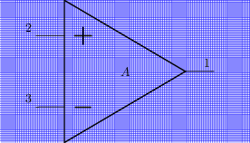 |
| [opamp-transimpedance-amplifier-with-voltage-gain1](sch/05_opamps/opamp-transimpedance-amplifier-with-voltage-gain1.sch) · Opamp transimpedance amplifier with voltage gain1 | e,r,w | etiquetas-globales, opamp, tierra, visibilidad-nodos | 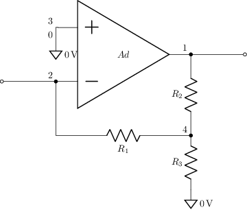 |
| [opamp-transimpedance-amplifier1](sch/05_opamps/opamp-transimpedance-amplifier1.sch) · Opamp transimpedance amplifier1 | e,i,p,r,w | espejo, etiquetas-globales, opamp, visibilidad-nodos | 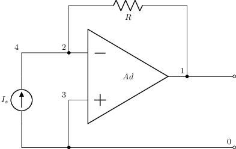 |
| [opamp-transimpedance-amplifier2](sch/05_opamps/opamp-transimpedance-amplifier2.sch) · Opamp transimpedance amplifier2 | c,e,i,p,r,v,w | espejo, opamp, visibilidad-nodos | 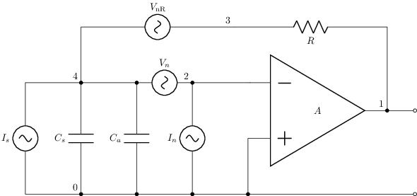 |
| [opamp-voltage-follower-c-load](sch/05_opamps/opamp-voltage-follower-C-load.sch) · Opamp voltage follower C load | c,e,p,w | espejo, opamp | 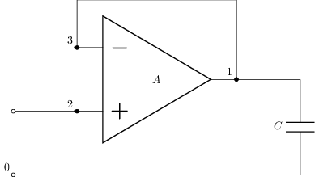 |
| [opamp-voltage-follower-c-load-model1](sch/05_opamps/opamp-voltage-follower-C-load-model1.sch) · Opamp voltage follower C load model1 | c,e,r,w | opamp | 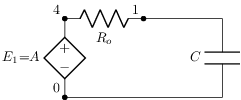 |
| [opamp-voltage-follower-c-load-open-loop](sch/05_opamps/opamp-voltage-follower-C-load-open-loop.sch) · Opamp voltage follower C load open loop | c,e,p,w | espejo, opamp, tierra | 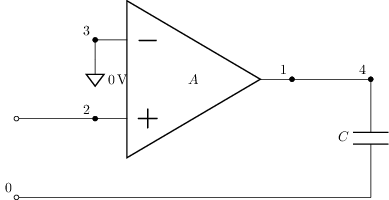 |
| [opamp-voltage-follower-rc-load](sch/05_opamps/opamp-voltage-follower-RC-load.sch) · Opamp voltage follower RC load | c,e,p,r,w | espejo, opamp | 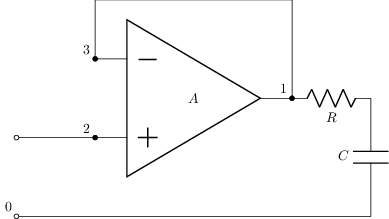 |
| [opamp-voltage-follower-rc-load-model1](sch/05_opamps/opamp-voltage-follower-RC-load-model1.sch) · Opamp voltage follower RC load model1 | c,e,r,w | opamp | 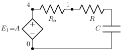 |
| [opamp-voltage-follower-rc-load-open-loop](sch/05_opamps/opamp-voltage-follower-RC-load-open-loop.sch) · Opamp voltage follower RC load open loop | c,e,p,r,w | espejo, opamp, tierra |  |
| [opamp-voltage-follower-rc-load-open-loop1](sch/05_opamps/opamp-voltage-follower-RC-load-open-loop1.sch) · Opamp voltage follower RC load open loop1 | c,e,p,r,w | espejo, opamp, tierra | 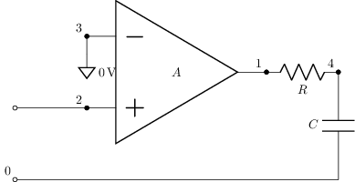 |
| [opamp1](sch/05_opamps/opamp1.sch) · Opamp1 | e | grilla, opamp | 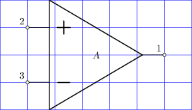 |
| [opamp2](sch/05_opamps/opamp2.sch) · Opamp2 | e | geometria-global, grilla, opamp | 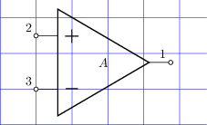 |
| [opamp3](sch/05_opamps/opamp3.sch) · Opamp3 | e | geometria-global, grilla, opamp | 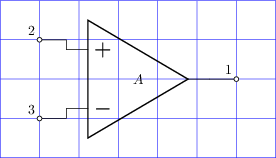 |
| [opamp4](sch/05_opamps/opamp4.sch) · Opamp4 | e | geometria-global, grilla, opamp | 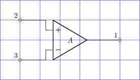 |
| [opamp5](sch/05_opamps/opamp5.sch) · Opamp5 | e,r | grilla, opamp | 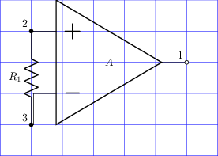 |
| [opamp6](sch/05_opamps/opamp6.sch) · Opamp6 | e,r,w | geometria-global, grilla, opamp | 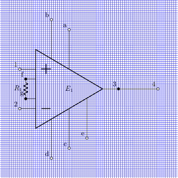 |
| [opamp7](sch/05_opamps/opamp7.sch) · Opamp7 | e,r,w | grilla, opamp |  |
| [opamp8](sch/05_opamps/opamp8.sch) · Opamp8 | e,r,w | geometria-global, grilla, opamp |  |
| [opamp9](sch/05_opamps/opamp9.sch) · Opamp9 | e,r,w | geometria-global, grilla, opamp |  |
| [opamps](sch/05_opamps/opamps.sch) · Opamps | e,o | espejo, opamp, pines, visibilidad-nodos |  |
| [opampup](sch/05_opamps/opampup.sch) · Opampup | e | opamp |  |
| [sallen-key-lpf1](sch/05_opamps/sallen-key-lpf1.sch) · Sallen key lpf1 | c,e,p,r,w | espejo, etiqueta-v, geometria-global, grilla, opamp, visibilidad-nodos |  |
| [sallen-key-lpf2](sch/05_opamps/sallen-key-lpf2.sch) · Sallen key lpf2 | c,e,p,r,w | espejo, etiqueta-v, grilla, opamp, visibilidad-nodos |  |
| [ufdopamp](sch/05_opamps/Ufdopamp.sch) · Ufdopamp | u | etiqueta, grilla, opamp, pines |  |
| [ufdopamps](sch/05_opamps/Ufdopamps.sch) · Ufdopamps | o,u | espejo, opamp, pines, visibilidad-nodos |  |
| [uinamp](sch/05_opamps/Uinamp.sch) · Uinamp | u | etiqueta, grilla, opamp, pines |  |
| [uisoamp](sch/05_opamps/Uisoamp.sch) · Uisoamp | u | etiqueta, grilla, opamp, pines |  |
| [uopamp](sch/05_opamps/Uopamp.sch) · Uopamp | u | etiqueta, grilla, opamp, pines |  |
| [uopamp1](sch/05_opamps/Uopamp1.sch) · Uopamp1 | u,w | opamp |  |
| [uopamp-comparison](sch/05_opamps/Uopamp_comparison.sch) · Uopamp comparison | o,u | etiqueta, grilla, opamp, pines |  |
| [uopamp-mirror](sch/05_opamps/Uopamp_mirror.sch) · Uopamp mirror | o,u | espejo, grilla, opamp, pines |  |
| [uopamps](sch/05_opamps/Uopamps.sch) · Uopamps | o,u | espejo, opamp, pines, visibilidad-nodos |  |
