# Magnéticos: transformadores, acoplamiento mutuo

Tema `06_magneticos` · **38** ejemplos. Espejados de lcapy (LGPL). Buscá por tag con `rg -l "n2t-tags:.*<tag>" sch/06_magneticos/`.

> Curricular: **Teoría de Circuitos II**

| ejemplo | componentes | tags | vista |
|---|---|---|---|
| [bh-mag](sch/06_magneticos/BH-mag.sch) · BH mag | c,d,l,m,o,v,w | estilo, etiqueta, etiqueta-i, etiqueta-v, geometria-global, kind, kind:nfet, magnetico | 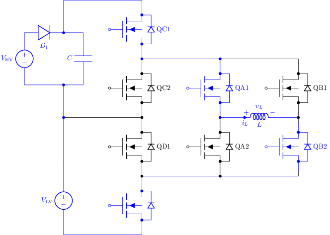 |
| [gy1](sch/06_magneticos/GY1.sch) · GY1 | gy | magnetico | 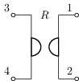 |
| [ideal-tf1](sch/06_magneticos/ideal-tf1.sch) · Ideal tf1 | p,tf,w | convencion, estilo-simbolo, etiqueta, etiqueta-f, etiqueta-v, etiquetas-globales, magnetico, visibilidad-nodos | 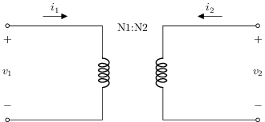 |
| [ideal-tf1-model1](sch/06_magneticos/ideal-tf1-model1.sch) · Ideal tf1 model1 | e,f,o,p,w | anotacion, convencion, estilo-simbolo, etiqueta, etiqueta-f, etiqueta-v, etiquetas-globales, magnetico | 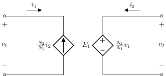 |
| [ideal-tf1-model2](sch/06_magneticos/ideal-tf1-model2.sch) · Ideal tf1 model2 | e,f,o,p,w | anotacion, convencion, estilo-simbolo, etiqueta, etiqueta-f, etiqueta-v, etiquetas-globales, magnetico | 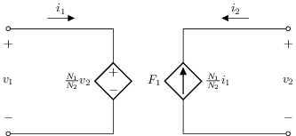 |
| [k1](sch/06_magneticos/K1.sch) · Acoplamiento mutuo | k,l | etiquetas-globales, magnetico | 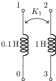 |
| [k2](sch/06_magneticos/K2.sch) · K2 | c,k,l,v,w | etiquetas-globales, magnetico | 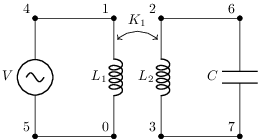 |
| [ltft](sch/06_magneticos/LTFT.sch) · LTFT | o,shape,w | estilo, etiqueta, etiquetas-globales, forma, layout, magnetico, visibilidad-nodos | 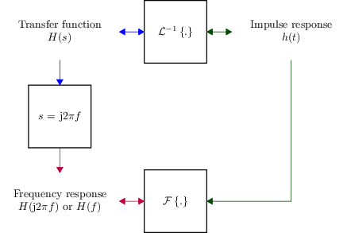 |
| [mutual1](sch/06_magneticos/mutual1.sch) · Mutual1 | k,l,r,v,w | etiquetas-globales, magnetico | 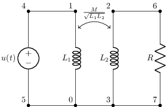 |
| [mutual2](sch/06_magneticos/mutual2.sch) · Mutual2 | l,r,v,w | etiquetas-globales, magnetico | 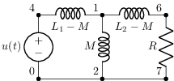 |
| [mutualinductances1](sch/06_magneticos/mutualinductances1.sch) · Mutualinductances1 | k,l,p,w | etiqueta-i, etiqueta-v, magnetico, visibilidad-nodos | 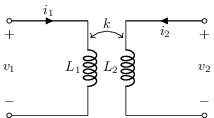 |
| [mutualinductances2](sch/06_magneticos/mutualinductances2.sch) · Mutualinductances2 | k,l,p,w | etiqueta-i, etiqueta-v, magnetico, visibilidad-nodos | 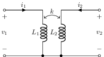 |
| [mutualinductances3](sch/06_magneticos/mutualinductances3.sch) · Mutualinductances3 | k,l,p,v,w | control, etiqueta-i, etiqueta-v, magnetico, visibilidad-nodos | 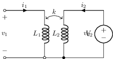 |
| [non-ideal-transformer](sch/06_magneticos/non-ideal-transformer.sch) · Non ideal transformer | l,p,r,tf,w | etiqueta, etiqueta-v, etiquetas-globales, magnetico, visibilidad-nodos | 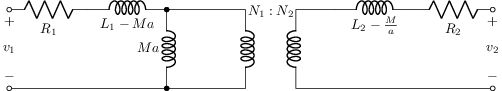 |
| [non-ideal-transformer-primary](sch/06_magneticos/non-ideal-transformer-primary.sch) · Non ideal transformer primary | l,p,r,tf,w | etiqueta, etiqueta-v, etiquetas-globales, magnetico, visibilidad-nodos | 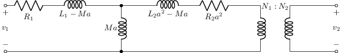 |
| [non-ideal-transformer1](sch/06_magneticos/non-ideal-transformer1.sch) · Non ideal transformer1 | l,p,tf,w | etiqueta, etiqueta-v, etiquetas-globales, magnetico, visibilidad-nodos | 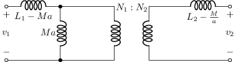 |
| [reluctance](sch/06_magneticos/reluctance.sch) · Reluctance | rel | magnetico | 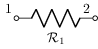 |
| [stepup](sch/06_magneticos/stepup.sch) · Stepup | m,tf,u,w | etiqueta, kind, magnetico, pines, tierra, visibilidad-nodos | 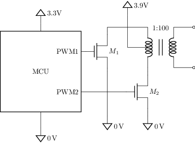 |
| [tee-model-transformer1](sch/06_magneticos/tee-model-transformer1.sch) · Tee model transformer1 | l,p,w | etiqueta-i, etiqueta-v, etiquetas-globales, magnetico, visibilidad-nodos | 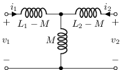 |
| [tee-model-transformer2](sch/06_magneticos/tee-model-transformer2.sch) · Tee model transformer2 | l,p,tf,w | etiqueta-i, etiqueta-v, etiquetas-globales, magnetico, visibilidad-nodos | 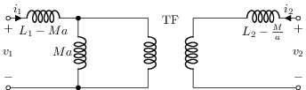 |
| [tee-model-transformer3](sch/06_magneticos/tee-model-transformer3.sch) · Tee model transformer3 | l,p,tf,w | etiqueta-i, etiqueta-v, etiquetas-globales, magnetico, visibilidad-nodos | 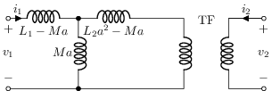 |
| [tf1](sch/06_magneticos/TF1.sch) · Transformador ideal | tf | magnetico | 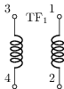 |
| [tf2](sch/06_magneticos/tf2.sch) · Tf2 | r,v,w | convencion, estilo-simbolo, etiquetas-globales, magnetico, visibilidad-nodos | 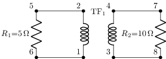 |
| [tf2](sch/06_magneticos/TF2.sch) · TF2 | r,tf,w | magnetico | ⚠️ no renderiza |
| [tf2w](sch/06_magneticos/TF2w.sch) · TF2w | o,tf | magnetico, visibilidad-nodos | 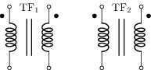 |
| [tf2wi](sch/06_magneticos/TF2wi.sch) · TF2wi | o,tf | espejo, magnetico, visibilidad-nodos |  |
| [tf3](sch/06_magneticos/TF3.sch) · TF3 | l,r,tf,w | magnetico | 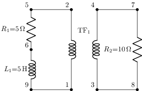 |
| [tf3w](sch/06_magneticos/TF3w.sch) · TF3w | o,tf | magnetico, visibilidad-nodos | 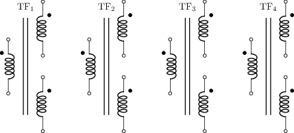 |
| [tf3wi](sch/06_magneticos/TF3wi.sch) · TF3wi | o,tf | espejo, magnetico, visibilidad-nodos | 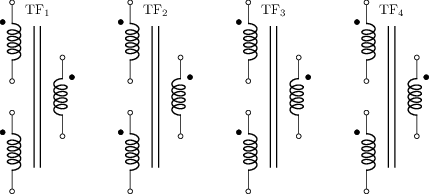 |
| [tf4](sch/06_magneticos/TF4.sch) · TF4 | tf | magnetico | 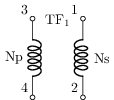 |
| [tf4wi](sch/06_magneticos/TF4wi.sch) · TF4wi | o,tf | magnetico, visibilidad-nodos | 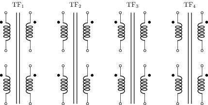 |
| [tfcore1](sch/06_magneticos/TFcore1.sch) · Transformador con núcleo | tf | kind, magnetico | 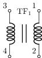 |
| [tfcore2](sch/06_magneticos/TFcore2.sch) · TFcore2 | r,tf,w | kind, magnetico | 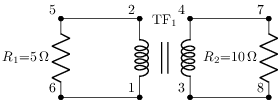 |
| [tfscs-stamp](sch/06_magneticos/TFscs-stamp.sch) · TFscs stamp | tf,w | etiqueta, etiqueta-i, magnetico | 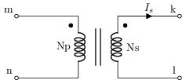 |
| [tfscss-stamp](sch/06_magneticos/TFscss-stamp.sch) · TFscss stamp | tf,w | etiqueta, etiqueta-i, magnetico | 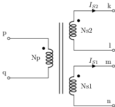 |
| [tftap1](sch/06_magneticos/TFtap1.sch) · TFtap1 | tf,w | magnetico | 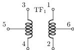 |
| [tftapcore1](sch/06_magneticos/TFtapcore1.sch) · TFtapcore1 | tf,w | kind, magnetico | 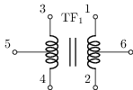 |
| [transformers](sch/06_magneticos/transformers.sch) · Transformers | o,tf,w | kind, magnetico | 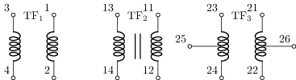 |
