# Cuadripolos / dos puertos

Tema `07_cuadripolos` · **15** ejemplos. Espejados de lcapy (LGPL). Buscá por tag con `rg -l "n2t-tags:.*<tag>" sch/07_cuadripolos/`.

> Curricular: **Teoría de Circuitos II**

| ejemplo | componentes | tags | vista |
|---|---|---|---|
| [btwoport1](sch/07_cuadripolos/Btwoport1.sch) · Btwoport1 | p,tp,w | cuadripolo, etiqueta, etiqueta-i, etiqueta-v, visibilidad-nodos | 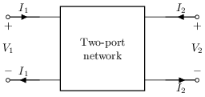 |
| [tf-current-gain](sch/07_cuadripolos/tf_current_gain.sch) · Tf current gain | a,i,p,tp,w | cuadripolo, estilo, etiqueta, etiqueta-i, etiquetas-globales, forma, pines, visibilidad-nodos | 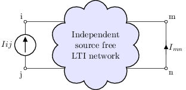 |
| [tf-transadmittance](sch/07_cuadripolos/tf_transadmittance.sch) · Tf transadmittance | a,p,tp,v,w | cuadripolo, estilo, etiqueta, etiqueta-i, etiquetas-globales, forma, pines, visibilidad-nodos | 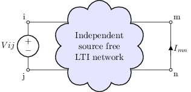 |
| [tf-transimpedance](sch/07_cuadripolos/tf_transimpedance.sch) · Tf transimpedance | a,i,p,tp,w | cuadripolo, estilo, etiqueta, etiqueta-v, etiquetas-globales, forma, pines, visibilidad-nodos | 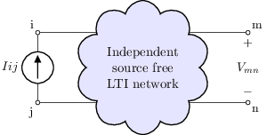 |
| [tf-twoport](sch/07_cuadripolos/tf_twoport.sch) · Tf twoport | a,p,tp,w | cuadripolo, estilo, etiqueta, etiqueta-i, etiqueta-v, etiquetas-globales, forma, pines | 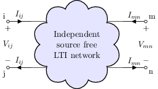 |
| [tf-voltage-gain](sch/07_cuadripolos/tf_voltage_gain.sch) · Tf voltage gain | a,p,tp,v,w | cuadripolo, estilo, etiqueta, etiqueta-v, etiquetas-globales, forma, pines, visibilidad-nodos | 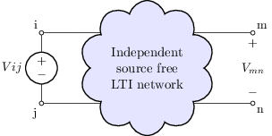 |
| [tp1](sch/07_cuadripolos/TP1.sch) · TP1 | tp | cuadripolo | 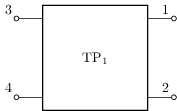 |
| [tpa](sch/07_cuadripolos/TPA.sch) · TPA | i,p,tp,v,w | cuadripolo, etiqueta, etiqueta-i, etiqueta-v, visibilidad-nodos | 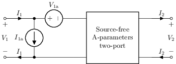 |
| [tpb](sch/07_cuadripolos/TPB.sch) · TPB | i,p,tp,v,w | cuadripolo, etiqueta, etiqueta-i, etiqueta-v, visibilidad-nodos | 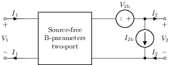 |
| [tpg](sch/07_cuadripolos/TPG.sch) · TPG | i,p,tp,v,w | cuadripolo, etiqueta, etiqueta-i, etiqueta-v, visibilidad-nodos | 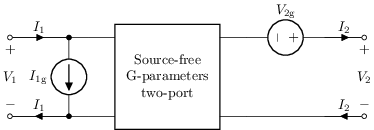 |
| [tph](sch/07_cuadripolos/TPH.sch) · TPH | i,p,tp,v,w | cuadripolo, etiqueta, etiqueta-i, etiqueta-v, visibilidad-nodos | 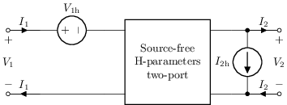 |
| [tpy](sch/07_cuadripolos/TPY.sch) · TPY | i,p,tp,w | cuadripolo, etiqueta, etiqueta-i, etiqueta-v, visibilidad-nodos | 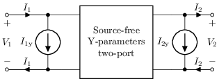 |
| [tpz](sch/07_cuadripolos/TPZ.sch) · TPZ | p,tp,v,w | cuadripolo, etiqueta, etiqueta-i, etiqueta-v, visibilidad-nodos | 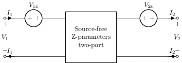 |
| [twoport1](sch/07_cuadripolos/twoport1.sch) · Cuadripolo genérico (caja) | p,tp,w | cuadripolo, etiqueta, etiqueta-i, etiqueta-v, visibilidad-nodos |  |
| [twoport2](sch/07_cuadripolos/twoport2.sch) · Cuadripolo genérico (variante) | p,tp,w | cuadripolo, etiqueta, etiqueta-i, etiqueta-v, forma, visibilidad-nodos | 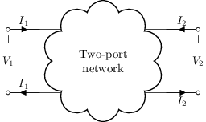 |
