# Redes: escaleras, secciones L/T/π, Foster

Tema `08_redes` · **18** ejemplos. Espejados de lcapy (LGPL). Buscá por tag con `rg -l "n2t-tags:.*<tag>" sch/08_redes/`.

> Curricular: **Teoría de Circuitos II**

| ejemplo | componentes | tags | vista |
|---|---|---|---|
| [fosteri](sch/08_redes/fosterI.sch) · FosterI | c,r,w | convencion, estilo-simbolo, etiquetas-globales, geometria-global, red, visibilidad-nodos | 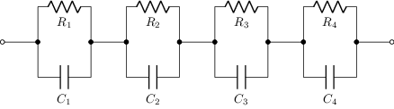 |
| [fosterii](sch/08_redes/fosterII.sch) · FosterII | c,r,w | convencion, estilo-simbolo, etiquetas-globales, geometria-global, red, visibilidad-nodos | 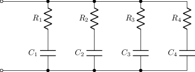 |
| [ladder](sch/08_redes/ladder.sch) · Red en escalera | o,p,w,y,z | etiqueta, etiqueta-i, etiqueta-v, red, visibilidad-nodos | 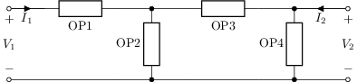 |
| [ladderalt](sch/08_redes/ladderalt.sch) · Ladderalt | o,p,w,y,z | etiqueta, etiqueta-i, etiqueta-v, red, visibilidad-nodos | 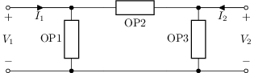 |
| [lsection](sch/08_redes/lsection.sch) · Sección en L | p,w,y,z | etiqueta, etiqueta-i, etiqueta-v, red, visibilidad-nodos | 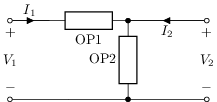 |
| [net1](sch/08_redes/net1.sch) · Net1 | r,w | red | 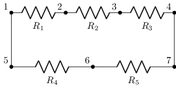 |
| [net2](sch/08_redes/net2.sch) · Net2 | r,w | red | 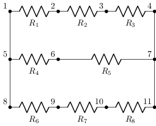 |
| [parallel](sch/08_redes/parallel.sch) · Parallel | r | layout, red, visibilidad-nodos | 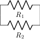 |
| [pisection](sch/08_redes/pisection.sch) · Sección en π | p,w,y,z | etiqueta, etiqueta-i, etiqueta-v, red, visibilidad-nodos | 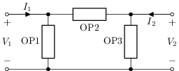 |
| [r4](sch/08_redes/R4.sch) · R4 | r | red | 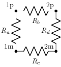 |
| [rnet1](sch/08_redes/rnet1.sch) · Rnet1 | r,w | red | 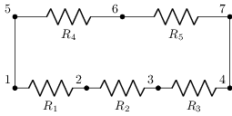 |
| [rnet2](sch/08_redes/rnet2.sch) · Rnet2 | r,w | red | 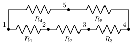 |
| [rnet3](sch/08_redes/rnet3.sch) · Rnet3 | r,w | red | 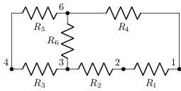 |
| [rnet4](sch/08_redes/rnet4.sch) · Rnet4 | r,w | red | 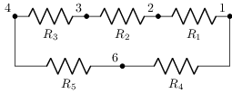 |
| [series](sch/08_redes/series.sch) · Series | p,w,z | etiqueta, etiqueta-i, etiqueta-v, red, visibilidad-nodos | 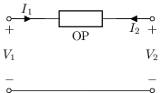 |
| [seriespair](sch/08_redes/seriespair.sch) · Seriespair | p,w,z | etiqueta, etiqueta-i, etiqueta-v, red, visibilidad-nodos | 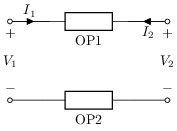 |
| [shunt](sch/08_redes/shunt.sch) · Shunt | p,w,z | etiqueta, etiqueta-i, etiqueta-v, red, visibilidad-nodos | 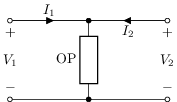 |
| [tsection](sch/08_redes/tsection.sch) · Sección en T | p,w,y,z | etiqueta, etiqueta-i, etiqueta-v, red, visibilidad-nodos | 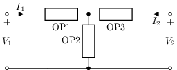 |
