# Circuitos de análisis (malla / nodal)

Tema `09_analisis` · **17** ejemplos. Espejados de lcapy (LGPL). Buscá por tag con `rg -l "n2t-tags:.*<tag>" sch/09_analisis/`.

> Curricular: **Teoría de Circuitos II**

| ejemplo | componentes | tags | vista |
|---|---|---|---|
| [amplifier1](sch/09_analisis/amplifier1.sch) · Amplifier1 | e,p,v,w | analisis, etiquetas-globales, visibilidad-nodos | 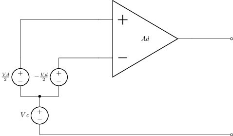 |
| [circuit-rlc-ivp1](sch/09_analisis/circuit-RLC-ivp1.sch) · Circuit RLC ivp1 | c,l,r,w | analisis, etiqueta-i, etiqueta-v, etiquetas-globales | 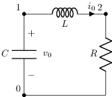 |
| [circuit-vrc1](sch/09_analisis/circuit-VRC1.sch) · Circuit VRC1 | c,r,v,w | analisis | 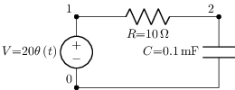 |
| [circuit-vrlc1](sch/09_analisis/circuit-VRLC1.sch) · Circuit VRLC1 | c,l,r,v,w | analisis | 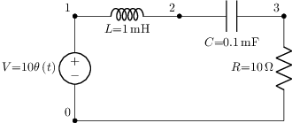 |
| [circuit-vrlc2](sch/09_analisis/circuit-VRLC2.sch) · Circuit VRLC2 | c,l,r,v,w | analisis |  |
| [graph1](sch/09_analisis/graph1.sch) · Graph1 | l,r,v,w | analisis, visibilidad-nodos | 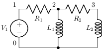 |
| [graph2](sch/09_analisis/graph2.sch) · Graph2 | c,l,r,v,w | analisis, visibilidad-nodos | 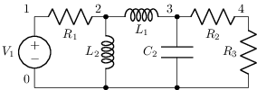 |
| [graph4](sch/09_analisis/graph4.sch) · Graph4 | c,l,r,v,w | analisis, etiqueta-i, etiqueta-v |  |
| [ladder1](sch/09_analisis/ladder1.sch) · Ladder1 | c,l,p,r,w | analisis, convencion, estilo-simbolo, etiquetas-globales, geometria-global, visibilidad-nodos | 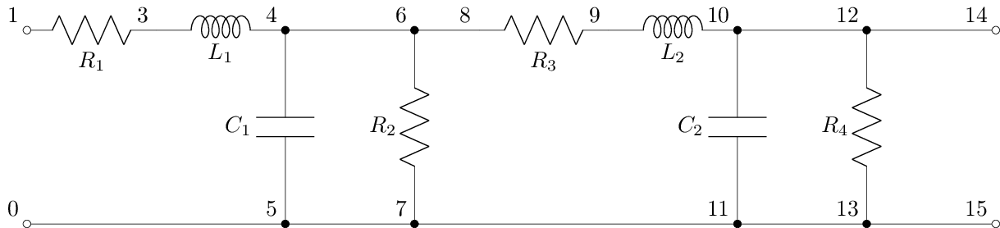 |
| [mesh2r](sch/09_analisis/mesh2R.sch) · Mesh2R | r,v,w | analisis | 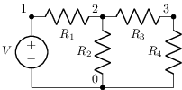 |
| [ss1](sch/09_analisis/ss1.sch) · Ss1 | c,l,r,v,w | analisis, etiqueta-i, etiqueta-v | 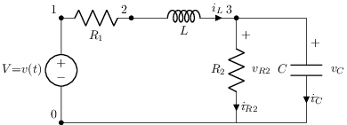 |
| [ss2](sch/09_analisis/ss2.sch) · Ss2 | c,l,r,v,w | analisis, etiqueta-i, etiqueta-v | 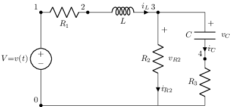 |
| [transfer1](sch/09_analisis/transfer1.sch) · Transfer1 | p,r,w | analisis, etiqueta-i, etiqueta-v, visibilidad-nodos | 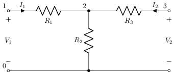 |
| [vrc1](sch/09_analisis/VRC1.sch) · VRC1 | c,r,v,w | analisis, etiquetas-globales, visibilidad-nodos | 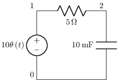 |
| [vrl1](sch/09_analisis/VRL1.sch) · VRL1 | l,r,v,w | analisis, etiquetas-globales, visibilidad-nodos | 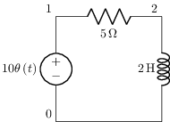 |
| [vrlc1](sch/09_analisis/VRLC1.sch) · VRLC1 | c,l,r,v,w | analisis | 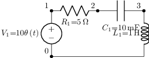 |
| [vrmesh1](sch/09_analisis/VRmesh1.sch) · VRmesh1 | r,v | analisis, etiqueta-v | 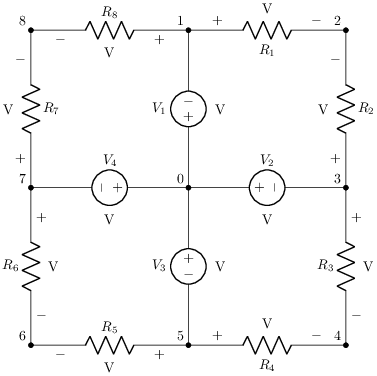 |
