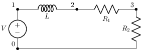
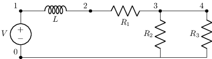
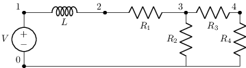
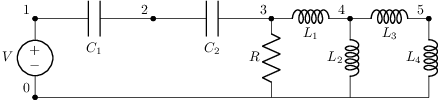
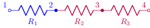
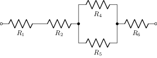
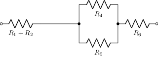
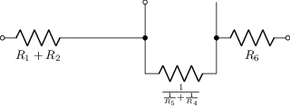
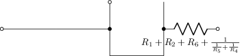
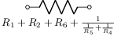

# Simplificación de circuitos

Tema `10_simplificacion` · **10** ejemplos. Espejados de lcapy (LGPL). Buscá por tag con `rg -l "n2t-tags:.*<tag>" sch/10_simplificacion/`.

> Curricular: **Teoría de Circuitos II**

| ejemplo | componentes | tags | vista |
|---|---|---|---|
| [circuit-simplify1](sch/10_simplificacion/circuit-simplify1.sch) · Circuit simplify1 | l,r,v,w | simplificacion |  |
| [circuit-simplify2](sch/10_simplificacion/circuit-simplify2.sch) · Circuit simplify2 | l,r,v,w | simplificacion |  |
| [circuit-simplify3](sch/10_simplificacion/circuit-simplify3.sch) · Circuit simplify3 | l,r,v,w | simplificacion |  |
| [circuit-simplify4](sch/10_simplificacion/circuit-simplify4.sch) · Circuit simplify4 | c,l,r,v,w | simplificacion |  |
| [inseries1](sch/10_simplificacion/inseries1.sch) · Inseries1 | r | estilo, simplificacion |  |
| [simplify-r1a](sch/10_simplificacion/simplify_R1a.sch) · Simplify R1a | r,w | etiquetas-globales, simplificacion, visibilidad-nodos |  |
| [simplify-r1b](sch/10_simplificacion/simplify_R1b.sch) · Simplify R1b | r,w | etiquetas-globales, simplificacion, visibilidad-nodos |  |
| [simplify-r1c](sch/10_simplificacion/simplify_R1c.sch) · Simplify R1c | o,r,w | etiquetas-globales, simplificacion, visibilidad-nodos |  |
| [simplify-r1d](sch/10_simplificacion/simplify_R1d.sch) · Simplify R1d | o,r,w | etiquetas-globales, simplificacion, visibilidad-nodos |  |
| [simplify-r1e](sch/10_simplificacion/simplify_R1e.sch) · Simplify R1e | r | etiquetas-globales, simplificacion, visibilidad-nodos |  |
