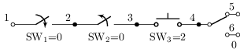
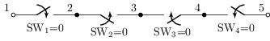
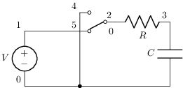
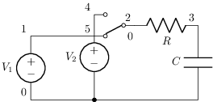
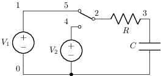
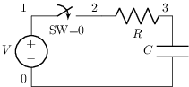
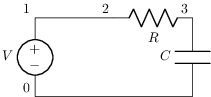
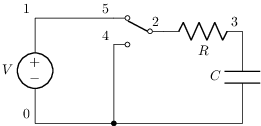
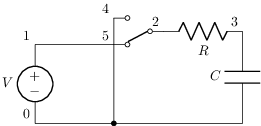
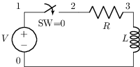

# Llaves y transitorios conmutados

Tema `11_switches` · **13** ejemplos. Espejados de lcapy (LGPL). Buscá por tag con `rg -l "n2t-tags:.*<tag>" sch/11_switches/`.

> Curricular: **Teoría de Circuitos II**

| ejemplo | componentes | tags | vista |
|---|---|---|---|
| [switches](sch/11_switches/switches.sch) · Tipos de llave | sw | switch |  |
| [switches2](sch/11_switches/switches2.sch) · Switches2 | sw | espejo, switch |  |
| [swrc](sch/11_switches/SWRC.sch) · SWRC | c,r,sw,v,w | espejo, switch, visibilidad-nodos |  |
| [swrc2](sch/11_switches/SWRC2.sch) · SWRC2 | c,r,sw,v,w | espejo, switch, visibilidad-nodos |  |
| [swrc2ivp](sch/11_switches/SWRC2ivp.sch) · SWRC2ivp | c,r,sw,v,w | control, espejo, etiqueta, switch, visibilidad-nodos |  |
| [swrc3](sch/11_switches/SWRC3.sch) · SWRC3 | c,r,sw,v,w | switch, visibilidad-nodos |  |
| [swrc3ivp](sch/11_switches/SWRC3ivp.sch) · SWRC3ivp | c,r,v,w | switch, visibilidad-nodos |  |
| [swrcafter](sch/11_switches/SWRCafter.sch) · SWRCafter | c,r,sw,v,w | control, espejo, etiqueta, switch, visibilidad-nodos |  |
| [swrcbefore](sch/11_switches/SWRCbefore.sch) · SWRCbefore | c,r,sw,v,w | control, espejo, etiqueta, switch, visibilidad-nodos |  |
| [swrcivp](sch/11_switches/SWRCivp.sch) · SWRCivp | c,r,sw,v,w | control, espejo, etiqueta, switch, visibilidad-nodos |  |
| [swri](sch/11_switches/SWRI.sch) · SWRI | l,r,sw,v,w | switch, visibilidad-nodos |  |
| [swrl](sch/11_switches/SWRL.sch) · SWRL | l,r,sw,v,w | switch, visibilidad-nodos |  |
| [swrlivp](sch/11_switches/SWRLivp.sch) · SWRLivp | l,r,v,w | switch, visibilidad-nodos |  |
