# Lógica: compuertas, flip-flops, multiplexores

Tema `12_logica` · **22** ejemplos. Espejados de lcapy (LGPL). Buscá por tag con `rg -l "n2t-tags:.*<tag>" sch/12_logica/`.

> Curricular: **Análisis de Señales y Sistemas**

| ejemplo | componentes | tags | vista |
|---|---|---|---|
| [buffer1](sch/12_logica/buffer1.sch) · Buffer1 | u | logica | 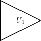 |
| [buffer2](sch/12_logica/buffer2.sch) · Buffer2 | u | logica, pines | 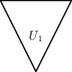 |
| [buffers](sch/12_logica/buffers.sch) · Buffers | u,w | logica | 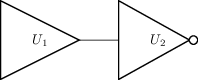 |
| [dff](sch/12_logica/dff.sch) · Dff | u | grilla, logica, visibilidad-nodos | 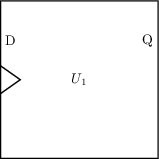 |
| [dff1](sch/12_logica/DFF1.sch) · DFF1 | u | etiqueta, grilla, logica, pines | 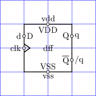 |
| [dff1b](sch/12_logica/DFF1b.sch) · DFF1b | r,u | grilla, logica, pines, visibilidad-nodos | 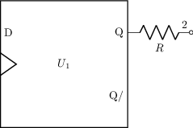 |
| [dff2](sch/12_logica/DFF2.sch) · DFF2 | u | grilla, logica, pines, visibilidad-nodos | 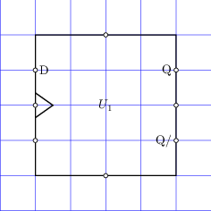 |
| [flipflops](sch/12_logica/flipflops.sch) · Flipflops | o,u | etiqueta, logica, pines | 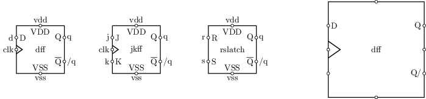 |
| [gates](sch/12_logica/gates.sch) · Gates | o,u | etiqueta, logica, pines, visibilidad-nodos | 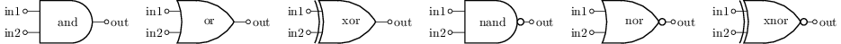 |
| [multiplexers](sch/12_logica/multiplexers.sch) · Multiplexers | o,u | etiqueta, logica, pines | 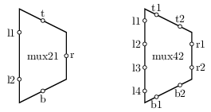 |
| [ubuffer](sch/12_logica/Ubuffer.sch) · Ubuffer | u | etiqueta, grilla, logica, pines |  |
| [ubuffer1](sch/12_logica/Ubuffer1.sch) · Ubuffer1 | u | grilla, logica | 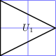 |
| [ubuffer2](sch/12_logica/Ubuffer2.sch) · Ubuffer2 | r,u | grilla, logica | 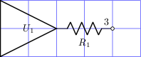 |
| [udff](sch/12_logica/Udff.sch) · Udff | u | etiqueta, grilla, logica, pines | 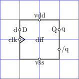 |
| [uinverter](sch/12_logica/Uinverter.sch) · Uinverter | u | etiqueta, grilla, logica, pines | 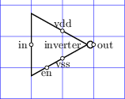 |
| [uinverter1](sch/12_logica/Uinverter1.sch) · Uinverter1 | u | grilla, logica | 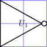 |
| [uinverter2](sch/12_logica/Uinverter2.sch) · Uinverter2 | r,u | grilla, logica | 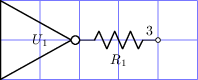 |
| [ujkff](sch/12_logica/Ujkff.sch) · Ujkff | u | etiqueta, grilla, logica, pines | 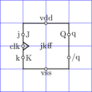 |
| [umux21](sch/12_logica/Umux21.sch) · Umux21 | u | etiqueta, grilla, logica, pines | 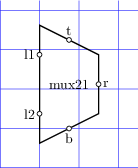 |
| [umux41](sch/12_logica/Umux41.sch) · Umux41 | u | etiqueta, grilla, logica, pines | 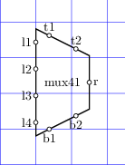 |
| [umux42](sch/12_logica/Umux42.sch) · Umux42 | u | etiqueta, grilla, logica, pines | 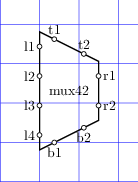 |
| [urslatch](sch/12_logica/Urslatch.sch) · Urslatch | u | etiqueta, grilla, logica, pines | 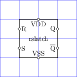 |
