# Formas, bloques, mezcladores, sumadores

Tema `13_formas_bloques` · **17** ejemplos. Espejados de lcapy (LGPL). Buscá por tag con `rg -l "n2t-tags:.*<tag>" sch/13_formas_bloques/`.

> Curricular: **Análisis de Señales y Sistemas**

| ejemplo | componentes | tags | vista |
|---|---|---|---|
| [frankenstein](sch/13_formas_bloques/frankenstein.sch) · Frankenstein | i,l,r,v | bloque, visibilidad-nodos | 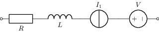 |
| [misc](sch/13_formas_bloques/misc.sch) · Misc | misc | bloque, etiqueta, kind, kind:memristor, kind:thermistor | 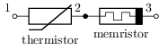 |
| [mx1](sch/13_formas_bloques/MX1.sch) · MX1 | mx,w | bloque, layout | 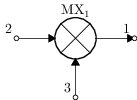 |
| [sbox1](sch/13_formas_bloques/Sbox1.sch) · Sbox1 | shape | bloque, etiqueta, grilla, pines | 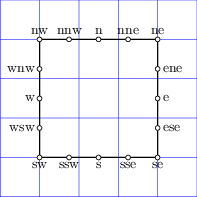 |
| [sbox2](sch/13_formas_bloques/Sbox2.sch) · Sbox2 | shape | bloque, etiqueta, grilla, pines | 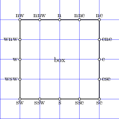 |
| [sbox3](sch/13_formas_bloques/Sbox3.sch) · Sbox3 | shape | bloque, etiqueta, grilla, pines | 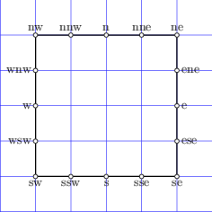 |
| [scircle1](sch/13_formas_bloques/Scircle1.sch) · Scircle1 | shape | bloque, grilla | 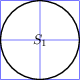 |
| [scircle2](sch/13_formas_bloques/Scircle2.sch) · Scircle2 | shape | bloque, etiqueta, grilla, pines | 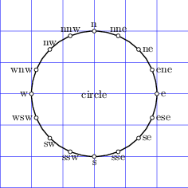 |
| [sp1](sch/13_formas_bloques/SP1.sch) · SP1 | sp,w | bloque, layout | 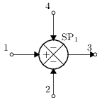 |
| [sp2](sch/13_formas_bloques/SP2.sch) · SP2 | sp,w | bloque, layout | 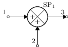 |
| [sp3](sch/13_formas_bloques/SP3.sch) · SP3 | sp,w | bloque, espejo, layout | 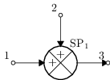 |
| [sp4](sch/13_formas_bloques/SP4.sch) · SP4 | sp,w | bloque, layout, visibilidad-nodos | 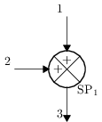 |
| [sp5](sch/13_formas_bloques/SP5.sch) · SP5 | sp,v,w | bloque, layout | 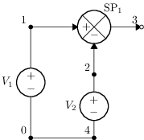 |
| [striangle2](sch/13_formas_bloques/Striangle2.sch) · Striangle2 | shape | bloque, etiqueta, forma, grilla, pines | 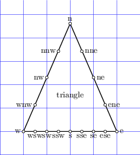 |
| [striangle3](sch/13_formas_bloques/Striangle3.sch) · Striangle3 | shape | bloque, etiqueta, forma, grilla, pines, rotacion | 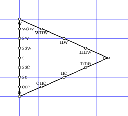 |
| [striangle4](sch/13_formas_bloques/Striangle4.sch) · Striangle4 | shape | bloque, etiqueta, forma, grilla, pines | 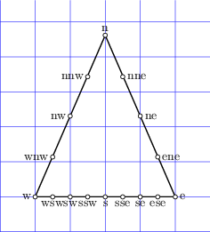 |
| [tr1](sch/13_formas_bloques/TR1.sch) · TR1 | tr,w | bloque, etiqueta, visibilidad-nodos | 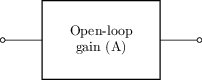 |
