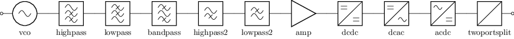
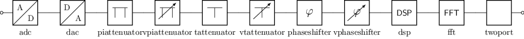
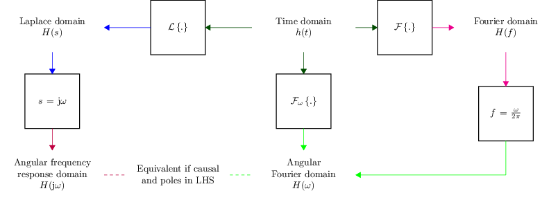
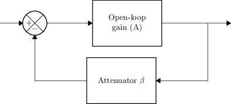
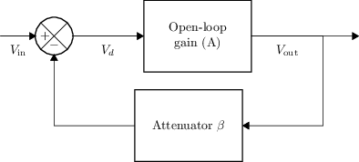
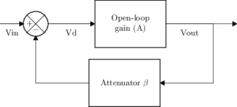
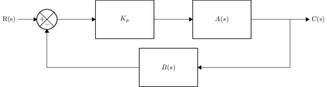

# Diagramas de bloques / realimentación

Tema `14_diagramas_bloques` · **7** ejemplos. Espejados de lcapy (LGPL). Buscá por tag con `rg -l "n2t-tags:.*<tag>" sch/14_diagramas_bloques/`.

> Curricular: **Análisis de Señales y Sistemas**

| ejemplo | componentes | tags | vista |
|---|---|---|---|
| [blocks](sch/14_diagramas_bloques/blocks.sch) · Blocks | bl | diagrama-bloques, etiqueta, kind, kind:acdc, kind:amp, kind:bandpass, kind:dcac, kind:dcdc |  |
| [blocks2](sch/14_diagramas_bloques/blocks2.sch) · Blocks2 | bl | diagrama-bloques, etiqueta, kind, kind:adc, kind:dac, kind:dsp, kind:fft, kind:phaseshifter |  |
| [domains](sch/14_diagramas_bloques/domains.sch) · Domains | shape,w | diagrama-bloques, estilo, etiqueta, etiquetas-globales, forma, layout, visibilidad-nodos |  |
| [negative-feedback1](sch/14_diagramas_bloques/negative-feedback1.sch) · Negative feedback1 | shape,sp,w | diagrama-bloques, etiqueta, forma, layout, visibilidad-nodos |  |
| [negative-feedback2](sch/14_diagramas_bloques/negative-feedback2.sch) · Negative feedback2 | shape,sp,w | diagrama-bloques, etiqueta, forma, layout, visibilidad-nodos |  |
| [negative-feedback3](sch/14_diagramas_bloques/negative-feedback3.sch) · Negative feedback3 | sp,tr,w | diagrama-bloques, etiqueta, layout, visibilidad-nodos |  |
| [proportional-control](sch/14_diagramas_bloques/proportional-control.sch) · Proportional control | a,sp,tr,w | diagrama-bloques, etiqueta, layout, pines, visibilidad-nodos |  |
