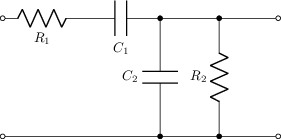
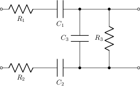
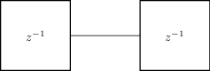
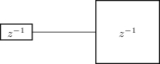
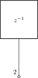
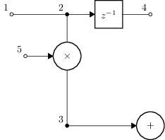
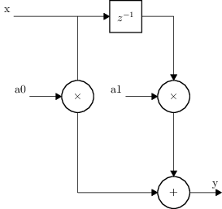

# DSP / FIR / tiempo discreto

Tema `15_dsp_fir` · **7** ejemplos. Espejados de lcapy (LGPL). Buscá por tag con `rg -l "n2t-tags:.*<tag>" sch/15_dsp_fir/`.

> Curricular: **Análisis de Señales y Sistemas**

| ejemplo | componentes | tags | vista |
|---|---|---|---|
| [filter1](sch/15_dsp_fir/filter1.sch) · Filter1 | c,p,r,w | dsp, visibilidad-nodos |  |
| [filter2](sch/15_dsp_fir/filter2.sch) · Filter2 | c,p,r,w | dsp, visibilidad-nodos |  |
| [fir1](sch/15_dsp_fir/fir1.sch) · Fir1 | shape,w | dsp, etiqueta |  |
| [fir2](sch/15_dsp_fir/fir2.sch) · Fir2 | shape,w | dsp, etiqueta, forma |  |
| [fir3](sch/15_dsp_fir/fir3.sch) · Fir3 | shape,w | dsp, etiqueta |  |
| [fir4](sch/15_dsp_fir/fir4.sch) · Fir4 | shape,w | dsp, etiqueta, layout |  |
| [fir5](sch/15_dsp_fir/fir5.sch) · Fir5 | o,shape,w | dsp, etiqueta, layout, visibilidad-nodos |  |
