# Chips, ICs, MCUs, reguladores, ADC/DAC

Tema `16_chips_ic` · **38** ejemplos. Espejados de lcapy (LGPL). Buscá por tag con `rg -l "n2t-tags:.*<tag>" sch/16_chips_ic/`.

| ejemplo | componentes | tags | vista |
|---|---|---|---|
| [adc1](sch/16_chips_ic/ADC1.sch) · ADC1 | u | chip, etiqueta, pines | 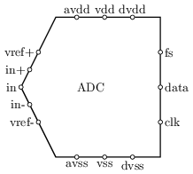 |
| [adc2](sch/16_chips_ic/ADC2.sch) · ADC2 | u | chip, espejo, grilla, pines | 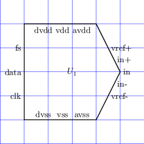 |
| [adc3](sch/16_chips_ic/ADC3.sch) · ADC3 | u | chip, pines | 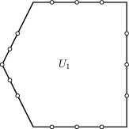 |
| [chips](sch/16_chips_ic/chips.sch) · Chips | o,u | chip, etiqueta, pines | 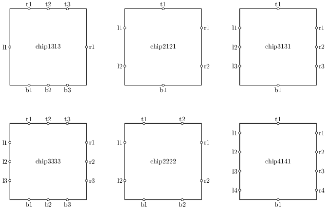 |
| [chips2](sch/16_chips_ic/chips2.sch) · Chips2 | o,u | chip, etiqueta, forma, pines | 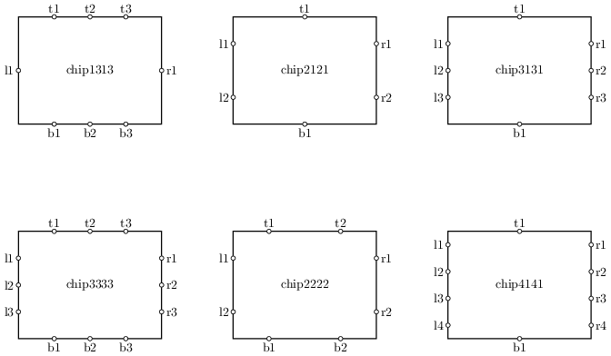 |
| [chips3](sch/16_chips_ic/chips3.sch) · Chips3 | o,u | chip, etiqueta, pines | 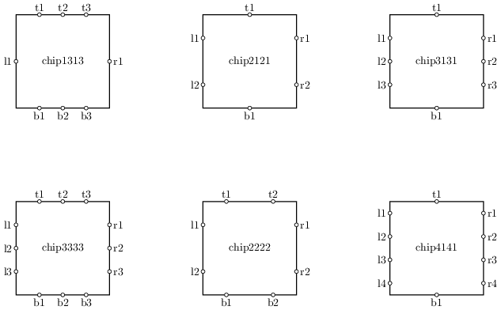 |
| [chips4](sch/16_chips_ic/chips4.sch) · Chips4 | o,u | chip, estilo, etiqueta, pines | 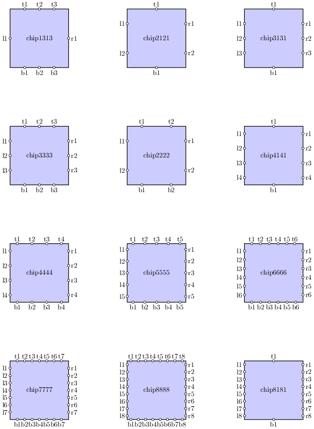 |
| [dac1](sch/16_chips_ic/DAC1.sch) · DAC1 | u | chip, etiqueta, pines | 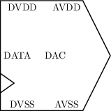 |
| [dac3](sch/16_chips_ic/DAC3.sch) · DAC3 | u | chip, etiqueta, pines | 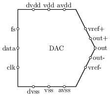 |
| [i2c2](sch/16_chips_ic/I2C2.sch) · I2C2 | r,u,w | chip, etiqueta, pines, tierra, visibilidad-nodos | 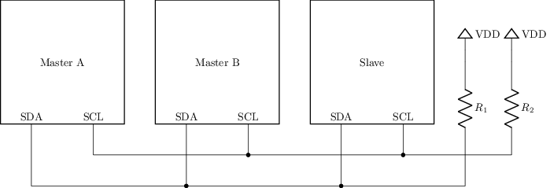 |
| [ic1](sch/16_chips_ic/ic1.sch) · Ic1 | d,r,u,w | chip, etiqueta, grilla, pines, tierra, visibilidad-nodos | 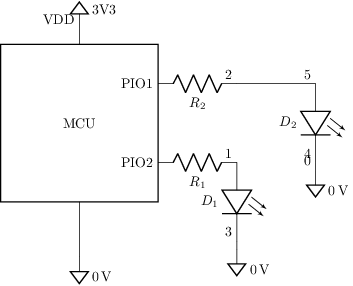 |
| [ic1b](sch/16_chips_ic/ic1b.sch) · Ic1b | d,r,u,w | chip, etiqueta, grilla, pines, tierra, visibilidad-nodos | 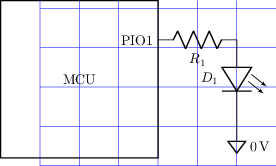 |
| [ic1c](sch/16_chips_ic/ic1c.sch) · Ic1c | d,r,u,w | chip, grilla, pines, tierra, visibilidad-nodos | 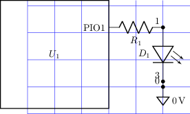 |
| [ic2](sch/16_chips_ic/ic2.sch) · Ic2 | d,r,u,w | chip, etiqueta, grilla, pines, tierra, visibilidad-nodos | 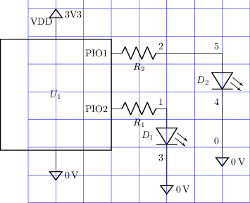 |
| [ic2b](sch/16_chips_ic/ic2b.sch) · Ic2b | u | chip, grilla, pines, visibilidad-nodos | 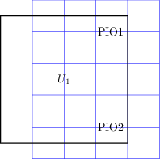 |
| [ic3](sch/16_chips_ic/ic3.sch) · Ic3 | u,w | chip, etiqueta, etiquetas-globales, forma, grilla, pines, tierra | 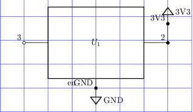 |
| [mcu-bt](sch/16_chips_ic/mcu-bt.sch) · Mcu bt | o,r,u,w | chip, etiqueta, forma, geometria-global, pines, tierra, visibilidad-nodos | 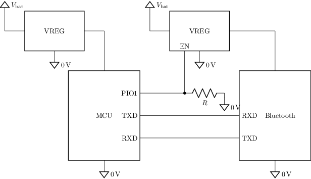 |
| [pic1](sch/16_chips_ic/pic1.sch) · Pic1 | c,l,p,r | chip, etiqueta-v | 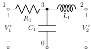 |
| [pic2](sch/16_chips_ic/pic2.sch) · Pic2 | c,l,p,r | chip | 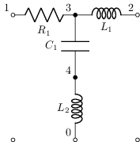 |
| [pic3](sch/16_chips_ic/pic3.sch) · Pic3 | c,l,p,r | chip | 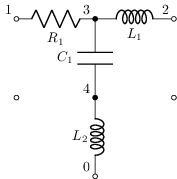 |
| [pic4](sch/16_chips_ic/pic4.sch) · Pic4 | c,l,p,r,w | chip, etiqueta-v | 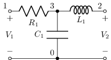 |
| [pic5](sch/16_chips_ic/pic5.sch) · Pic5 | c,l,p,r | chip | 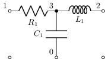 |
| [pic6](sch/16_chips_ic/pic6.sch) · Pic6 | c,l,p,r,w | chip |  |
| [pic7](sch/16_chips_ic/pic7.sch) · Pic7 | c,l,p,r,w | chip | 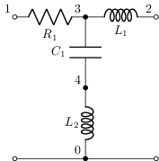 |
| [pio-input2](sch/16_chips_ic/PIO-input2.sch) · PIO input2 | a,u,w | chip, espejo, estilo, etiqueta, pad-senal, pines, visibilidad-nodos | 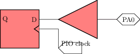 |
| [pio-input3](sch/16_chips_ic/PIO-input3.sch) · PIO input3 | a,u,w | chip, espejo, estilo, etiqueta, pad-senal, pines, visibilidad-nodos | 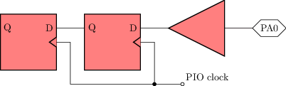 |
| [pio-output2](sch/16_chips_ic/PIO-output2.sch) · PIO output2 | o,u,w | chip, estilo, etiqueta, layout, pad-senal, pines, visibilidad-nodos | 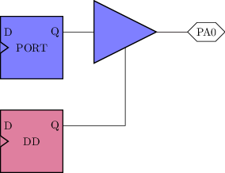 |
| [pio-pullup2](sch/16_chips_ic/PIO-pullup2.sch) · PIO pullup2 | m,r,u,w | chip, espejo, estilo, etiqueta, pad-senal, pines, tierra, visibilidad-nodos | 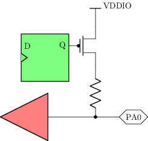 |
| [pio1](sch/16_chips_ic/PIO1.sch) · PIO1 | u,w | chip, espejo, estilo, etiqueta, pad-senal, visibilidad-nodos | 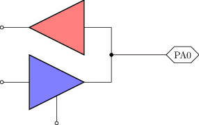 |
| [uadc](sch/16_chips_ic/Uadc.sch) · Uadc | u | chip, etiqueta, grilla, pines | 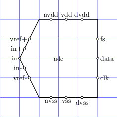 |
| [uchip1313](sch/16_chips_ic/Uchip1313.sch) · Uchip1313 | u | chip, etiqueta, grilla, pines | 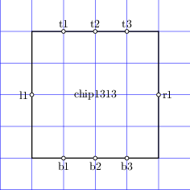 |
| [uchip2121](sch/16_chips_ic/Uchip2121.sch) · Uchip2121 | u | chip, etiqueta, grilla, pines | 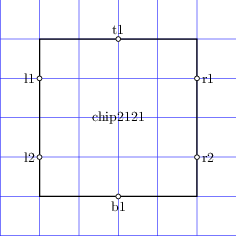 |
| [uchip2222](sch/16_chips_ic/Uchip2222.sch) · Uchip2222 | u | chip, etiqueta, grilla, pines | 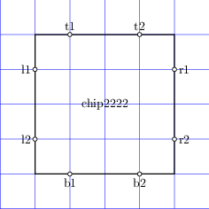 |
| [uchip3131](sch/16_chips_ic/Uchip3131.sch) · Uchip3131 | u | chip, etiqueta, grilla, pines | 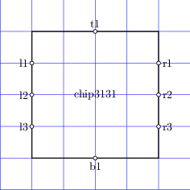 |
| [uchip3333](sch/16_chips_ic/Uchip3333.sch) · Uchip3333 | u | chip, etiqueta, grilla, pines | 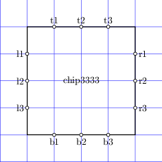 |
| [uchip4141](sch/16_chips_ic/Uchip4141.sch) · Uchip4141 | u | chip, etiqueta, grilla, pines | 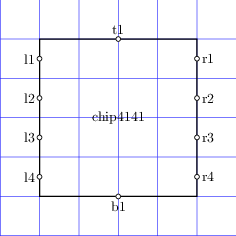 |
| [udac](sch/16_chips_ic/Udac.sch) · Udac | u | chip, etiqueta, grilla, pines | 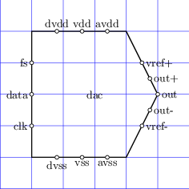 |
| [uregulator](sch/16_chips_ic/Uregulator.sch) · Uregulator | u | chip, etiqueta, grilla, pines | 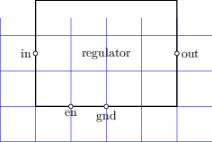 |
