# Modelado CMOS

Tema `17_cmos` · **25** ejemplos. Espejados de lcapy (LGPL). Buscá por tag con `rg -l "n2t-tags:.*<tag>" sch/17_cmos/`.

| ejemplo | componentes | tags | vista |
|---|---|---|---|
| [cmos-backdrive1](sch/17_cmos/cmos-backdrive1.sch) · Cmos backdrive1 | u,w | cmos, etiqueta, tierra, visibilidad-nodos | 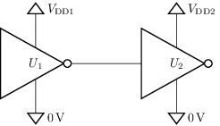 |
| [cmos-backdrive2](sch/17_cmos/cmos-backdrive2.sch) · Cmos backdrive2 | d,m,u,w | cmos, estilo, etiqueta, geometria-global, layout, tierra, visibilidad-nodos | 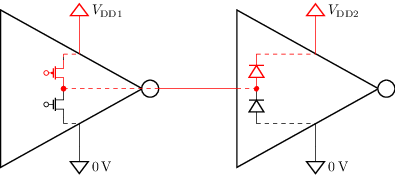 |
| [cmos-backdrive3](sch/17_cmos/cmos-backdrive3.sch) · Cmos backdrive3 | m,u,w | cmos, estilo, etiqueta, geometria-global, tierra, visibilidad-nodos | 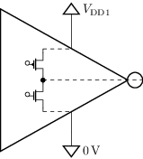 |
| [cmos-esd-damage](sch/17_cmos/cmos-esd-damage.sch) · Cmos esd damage | c,r,sw,w | cmos, etiqueta, etiqueta-v, etiquetas-globales, raw-tikz, visibilidad-nodos | 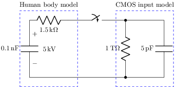 |
| [cmos-high-low](sch/17_cmos/cmos-high-low.sch) · Cmos high low | c,p,r,sw,v,w | cmos, etiqueta, etiqueta-i, etiqueta-v, etiquetas-globales, visibilidad-nodos | 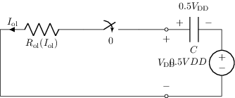 |
| [cmos-high-low-simple](sch/17_cmos/cmos-high-low-simple.sch) · Cmos high low simple | c,p,r,sw,w | cmos, etiqueta, etiqueta-i, etiqueta-v, etiquetas-globales, visibilidad-nodos | 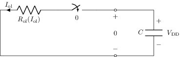 |
| [cmos-input-model](sch/17_cmos/cmos-input-model.sch) · Cmos input model | c,p,r,v,w | cmos, visibilidad-nodos | 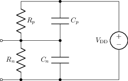 |
| [cmos-input-model-thevenin](sch/17_cmos/cmos-input-model-thevenin.sch) · Cmos input model thevenin | c,p,r,v,w | cmos, etiquetas-globales, visibilidad-nodos |  |
| [cmos-input-model1](sch/17_cmos/cmos-input-model1.sch) · Cmos input model1 | d,m,p,v,w | cmos, visibilidad-nodos | 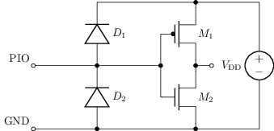 |
| [cmos-input-model2](sch/17_cmos/cmos-input-model2.sch) · Cmos input model2 | c,p,r,v,w | cmos, etiqueta, etiquetas-globales, visibilidad-nodos | 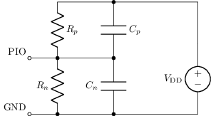 |
| [cmos-input-model3](sch/17_cmos/cmos-input-model3.sch) · Cmos input model3 | c,p,r,v,w | cmos, etiquetas-globales, visibilidad-nodos | 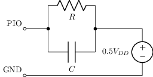 |
| [cmos-input-model4](sch/17_cmos/cmos-input-model4.sch) · Cmos input model4 | c,p,r,w | cmos, raw-tikz, visibilidad-nodos | 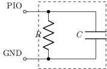 |
| [cmos-input-model5](sch/17_cmos/cmos-input-model5.sch) · Cmos input model5 | c,p,r,w | cmos, raw-tikz, visibilidad-nodos | 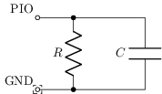 |
| [cmos-input-model6](sch/17_cmos/cmos-input-model6.sch) · Cmos input model6 | c,r,w | cmos, etiquetas-globales, raw-tikz, visibilidad-nodos | 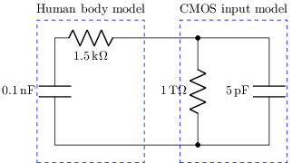 |
| [cmos-led-model1](sch/17_cmos/cmos-led-model1.sch) · Cmos led model1 | d,p,r,v,w | cmos, etiqueta, etiqueta-i, etiqueta-v, visibilidad-nodos | 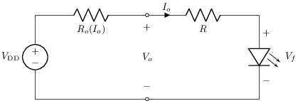 |
| [cmos-led1](sch/17_cmos/cmos-led1.sch) · Cmos led1 | d,o,r,u,w | cmos, etiqueta, etiqueta-i, etiqueta-v, tierra, visibilidad-nodos | 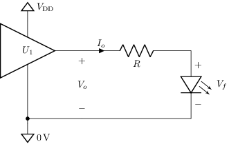 |
| [cmos-low-high](sch/17_cmos/cmos-low-high.sch) · Cmos low high | c,p,r,sw,v,w | cmos, etiqueta, etiqueta-i, etiqueta-v, etiquetas-globales, visibilidad-nodos | 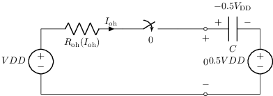 |
| [cmos-low-high-simple](sch/17_cmos/cmos-low-high-simple.sch) · Cmos low high simple | c,p,r,sw,v,w | cmos, etiqueta, etiqueta-i, etiqueta-v, etiquetas-globales, visibilidad-nodos | 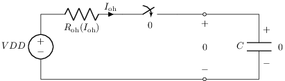 |
| [cmos-open-drain](sch/17_cmos/cmos-open-drain.sch) · Cmos open drain | m,r,w | cmos, etiqueta, etiquetas-globales, tierra, visibilidad-nodos | 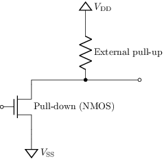 |
| [cmos-protection1](sch/17_cmos/cmos-protection1.sch) · Cmos protection1 | d,r,u,w | cmos | 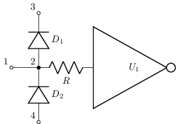 |
| [cmos-protection2](sch/17_cmos/cmos-protection2.sch) · Cmos protection2 | d,r,u,w | cmos, etiqueta, tierra, visibilidad-nodos | 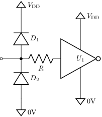 |
| [cmos-simple-output-model](sch/17_cmos/cmos-simple-output-model.sch) · Cmos simple output model | p,r,sw,v,w | cmos, etiqueta, visibilidad-nodos | 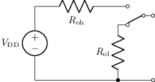 |
| [cmos-totem](sch/17_cmos/cmos-totem.sch) · Cmos totem | m,w | cmos, etiqueta, etiquetas-globales, pad-senal, tierra, visibilidad-nodos | 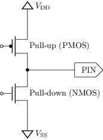 |
| [cmos-totem2](sch/17_cmos/cmos-totem2.sch) · Cmos totem2 | d,m,w | cmos, etiqueta, etiquetas-globales, pad-senal, tierra, visibilidad-nodos | 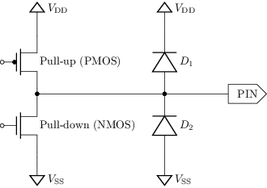 |
| [cmos1](sch/17_cmos/cmos1.sch) · Cmos1 | m,p,w | cmos | 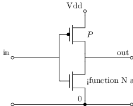 |
