# Líneas de transmisión, cables, antenas, cristales

Tema `18_lineas_transmision` · **24** ejemplos. Espejados de lcapy (LGPL). Buscá por tag con `rg -l "n2t-tags:.*<tag>" sch/18_lineas_transmision/`.

| ejemplo | componentes | tags | vista |
|---|---|---|---|
| [antenna](sch/18_lineas_transmision/antenna.sch) · Antenna | ant | kind, kind:rx, linea-transmision | 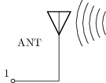 |
| [antennas](sch/18_lineas_transmision/antennas.sch) · Antennas | ant | espejo, etiqueta, kind, kind:rx, kind:tx, linea-transmision | 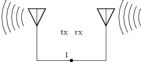 |
| [cable](sch/18_lineas_transmision/cable.sch) · Cable | cable | kind, kind:tline, linea-transmision, pines | 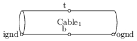 |
| [cable-coax](sch/18_lineas_transmision/cable-coax.sch) · Cable coax | cable,w | estilo, kind, kind:coax, linea-transmision | 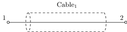 |
| [cable-tline](sch/18_lineas_transmision/cable-tline.sch) · Cable tline | cable,w | kind, kind:tline, linea-transmision | 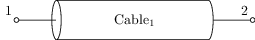 |
| [cable-tline2](sch/18_lineas_transmision/cable-tline2.sch) · Cable tline2 | cable,w | grilla, kind, kind:tline, linea-transmision | 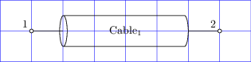 |
| [cable-tline3](sch/18_lineas_transmision/cable-tline3.sch) · Cable tline3 | cable,w | forma, grilla, kind, kind:tline, linea-transmision | 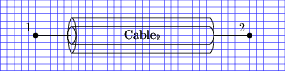 |
| [cable-tp](sch/18_lineas_transmision/cable-tp.sch) · Cable tp | cable,w | estilo, kind, kind:shieldedtwistedpair, linea-transmision | 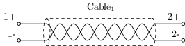 |
| [cable-twinax](sch/18_lineas_transmision/cable-twinax.sch) · Cable twinax | cable,w | estilo, kind, kind:twinax, linea-transmision | 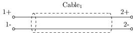 |
| [cable-utp](sch/18_lineas_transmision/cable-utp.sch) · Cable utp | cable,w | estilo, kind, kind:twistedpair, linea-transmision | 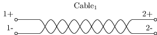 |
| [cable4](sch/18_lineas_transmision/cable4.sch) · Cable4 | cable,w | estilo, kind, kind:twistedpair, linea-transmision |  |
| [guard1](sch/18_lineas_transmision/guard1.sch) · Guard1 | c,cable,e,r,w | control, espejo, estilo, geometria-global, kind, kind:coax, layout, linea-transmision | 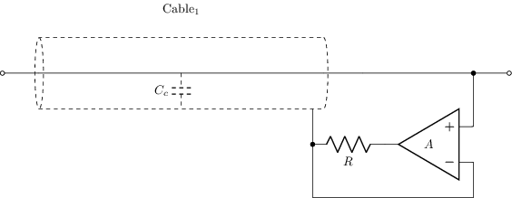 |
| [pierce-oscillator](sch/18_lineas_transmision/pierce-oscillator.sch) · Pierce oscillator | c,r,u,w,xt | etiqueta, linea-transmision, tierra, visibilidad-nodos | 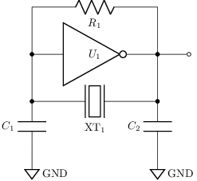 |
| [shield-ground](sch/18_lineas_transmision/shield-ground.sch) · Shield ground | c,cable,e,r,v,w | estilo, etiqueta, geometria-global, kind, kind:coax, linea-transmision, tierra, visibilidad-nodos | 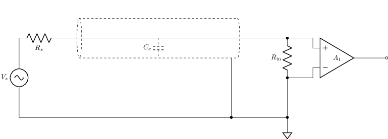 |
| [shield-guard](sch/18_lineas_transmision/shield-guard.sch) · Shield guard | c,cable,e,r,v,w | espejo, estilo, etiqueta, geometria-global, kind, kind:coax, linea-transmision, tierra | 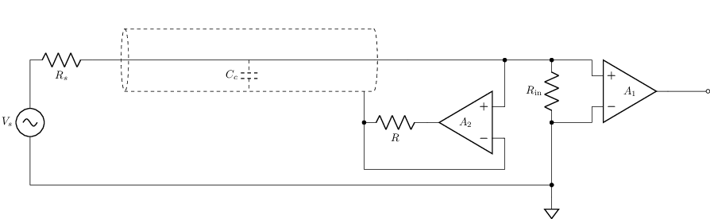 |
| [tline1](sch/18_lineas_transmision/tline1.sch) · Tline1 | tl | grilla, linea-transmision | 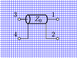 |
| [tline2](sch/18_lineas_transmision/tline2.sch) · Tline2 | r,tl,u,w | etiqueta, geometria-global, linea-transmision, visibilidad-nodos | 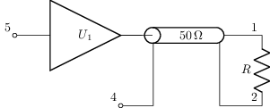 |
| [tline3](sch/18_lineas_transmision/tline3.sch) · Tline3 | r,tl,u,w | etiqueta, geometria-global, linea-transmision, tierra, visibilidad-nodos | 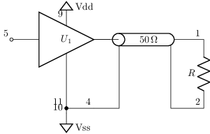 |
| [tline4](sch/18_lineas_transmision/tline4.sch) · Tline4 | tl | grilla, linea-transmision | 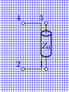 |
| [tline5](sch/18_lineas_transmision/tline5.sch) · Tline5 | tl,u,w | etiqueta, geometria-global, layout, linea-transmision, visibilidad-nodos | 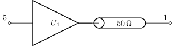 |
| [txline1](sch/18_lineas_transmision/txline1.sch) · Txline1 | p,r,tl,v,w | etiqueta, etiqueta-v, linea-transmision, visibilidad-nodos | 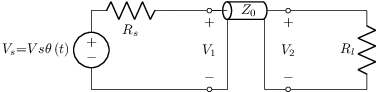 |
| [xt1](sch/18_lineas_transmision/XT1.sch) · XT1 | xt | linea-transmision | 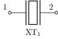 |
| [xt2](sch/18_lineas_transmision/XT2.sch) · XT2 | c,xt | linea-transmision | 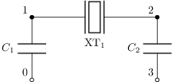 |
| [xt3](sch/18_lineas_transmision/XT3.sch) · XT3 | c,xt | geometria-global, linea-transmision | 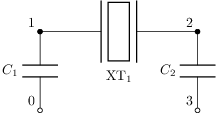 |
