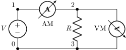
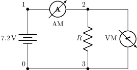

# Medidores (amperímetro / voltímetro)

Tema `19_medidores` · **2** ejemplos. Espejados de lcapy (LGPL). Buscá por tag con `rg -l "n2t-tags:.*<tag>" sch/19_medidores/`.

> Curricular: **Teoría de Circuitos II**

| ejemplo | componentes | tags | vista |
|---|---|---|---|
| [meters1](sch/19_medidores/meters1.sch) · Meters1 | am,r,v,vm,w | medidor |  |
| [meters2](sch/19_medidores/meters2.sch) · Meters2 | am,bat,r,vm,w | etiqueta, medidor |  |
