# Tierras, alimentación, conexiones implícitas

Tema `20_tierras_alimentacion` · **19** ejemplos. Espejados de lcapy (LGPL). Buscá por tag con `rg -l "n2t-tags:.*<tag>" sch/20_tierras_alimentacion/`.

> Curricular: **Teoría de Circuitos II**

| ejemplo | componentes | tags | vista |
|---|---|---|---|
| [autoground1](sch/20_tierras_alimentacion/autoground1.sch) · Autoground1 | i,l,r,w | etiquetas-globales, tierra | 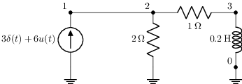 |
| [autoground2](sch/20_tierras_alimentacion/autoground2.sch) · Autoground2 | i,l,r,w | etiquetas-globales, tierra | 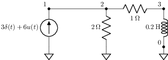 |
| [autoground3](sch/20_tierras_alimentacion/autoground3.sch) · Autoground3 | i,l,p,r,w | etiquetas-globales, tierra | 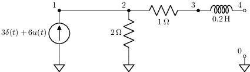 |
| [batteries](sch/20_tierras_alimentacion/batteries.sch) · Batteries | bat | etiqueta, kind, kind:cell1, tierra, visibilidad-nodos | 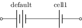 |
| [connections1](sch/20_tierras_alimentacion/connections1.sch) · Connections1 | o,w | estilo, etiqueta, pad-senal, tierra, visibilidad-nodos |  |
| [connections2](sch/20_tierras_alimentacion/connections2.sch) · Connections2 | o,w | estilo, etiqueta, forma, pad-senal, tierra | 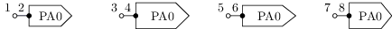 |
| [connections3](sch/20_tierras_alimentacion/connections3.sch) · Connections3 | u,w | estilo, etiqueta, etiqueta-nodo, pad-senal, tierra, visibilidad-nodos | 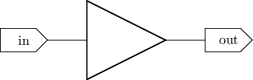 |
| [ground1](sch/20_tierras_alimentacion/ground1.sch) · Ground1 | r,w | tierra | 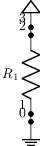 |
| [grounddown1](sch/20_tierras_alimentacion/grounddown1.sch) · Grounddown1 | r,w | tierra | 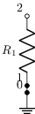 |
| [groundloop1](sch/20_tierras_alimentacion/groundloop1.sch) · Groundloop1 | i,r,v,w | tierra | 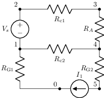 |
| [groundloop1-break](sch/20_tierras_alimentacion/groundloop1-break.sch) · Groundloop1 break | r,v,w | tierra | 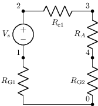 |
| [grounds](sch/20_tierras_alimentacion/grounds.sch) · Tipos de tierra | a,w | etiqueta, pines, tierra, visibilidad-nodos | 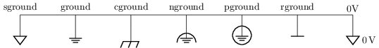 |
| [grounds2](sch/20_tierras_alimentacion/grounds2.sch) · Grounds2 | a,w | etiqueta, pines, tierra, visibilidad-nodos | 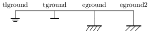 |
| [implicit1](sch/20_tierras_alimentacion/implicit1.sch) · Implicit1 | r | alimentacion, tierra | 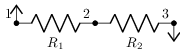 |
| [implicit2](sch/20_tierras_alimentacion/implicit2.sch) · Implicit2 | r | alimentacion, etiqueta, tierra | 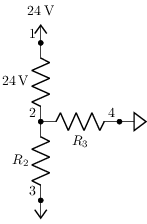 |
| [implicit3](sch/20_tierras_alimentacion/implicit3.sch) · Implicit3 | m,r,w | alimentacion, etiqueta-nodo, kind, kind:nfet, tierra | 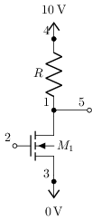 |
| [implicit-star](sch/20_tierras_alimentacion/implicit_star.sch) · Implicit star | w | etiqueta, rotacion, tierra, visibilidad-nodos | 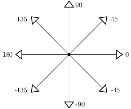 |
| [implicit-wire1](sch/20_tierras_alimentacion/implicit_wire1.sch) · Implicit wire1 | v,w | etiqueta, tierra, visibilidad-nodos | 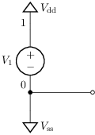 |
| [supplies](sch/20_tierras_alimentacion/supplies.sch) · Rieles de alimentación | r | alimentacion, tierra | 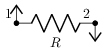 |
