# Etiquetas, anotaciones, V/I/F, estilos de cable

Tema `21_etiquetas` · **33** ejemplos. Espejados de lcapy (LGPL). Buscá por tag con `rg -l "n2t-tags:.*<tag>" sch/21_etiquetas/`.

> Curricular: **Teoría de Circuitos II**

| ejemplo | componentes | tags | vista |
|---|---|---|---|
| [annotate1](sch/21_etiquetas/annotate1.sch) · Annotate1 | a,r | etiqueta, pines, visibilidad-nodos |  |
| [annotate2](sch/21_etiquetas/annotate2.sch) · Annotate2 | a,shape | etiqueta, pines, visibilidad-nodos | 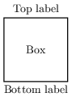 |
| [arrows](sch/21_etiquetas/arrows.sch) · Arrows | w | etiqueta, grilla, layout, visibilidad-nodos | 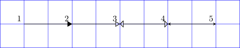 |
| [arrows2](sch/21_etiquetas/arrows2.sch) · Arrows2 | w | etiqueta, layout, pad-senal | 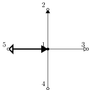 |
| [attr1](sch/21_etiquetas/attr1.sch) · Attr1 | r | estilo, etiqueta | 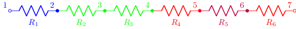 |
| [circuit](sch/21_etiquetas/circuit.sch) · Circuit | r,v,w | etiqueta | 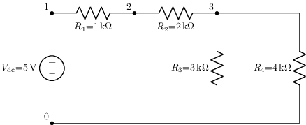 |
| [circuit1](sch/21_etiquetas/circuit1.sch) · Circuit1 | r,v,w | etiqueta, visibilidad-nodos | 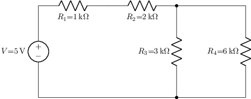 |
| [colors1](sch/21_etiquetas/colors1.sch) · Colors1 | o,shape | estilo, etiqueta | 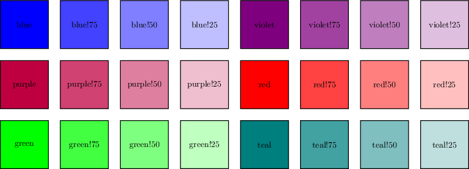 |
| [current-labels1](sch/21_etiquetas/current_labels1.sch) · Etiquetas de corriente (todas las variantes) | r | etiqueta, etiqueta-i, visibilidad-nodos | 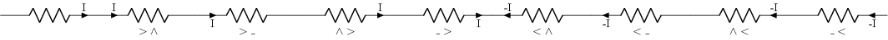 |
| [current-labels2](sch/21_etiquetas/current_labels2.sch) · Current labels2 | r | etiqueta, etiqueta-i, visibilidad-nodos | 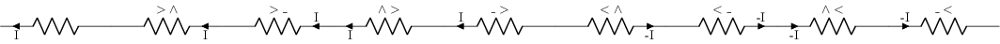 |
| [currents](sch/21_etiquetas/currents.sch) · Currents | r,w | etiqueta, etiqueta-i | 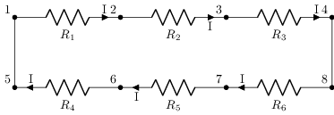 |
| [demo1](sch/21_etiquetas/demo1.sch) · Demo1 | c,r,v,w | etiqueta, geometria-global | 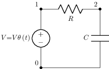 |
| [fliplr1](sch/21_etiquetas/fliplr1.sch) · Fliplr1 | o,u | espejo, etiqueta | 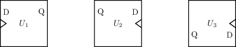 |
| [flow-labels1](sch/21_etiquetas/flow_labels1.sch) · Etiquetas de flujo | r | etiqueta, etiqueta-f, visibilidad-nodos | 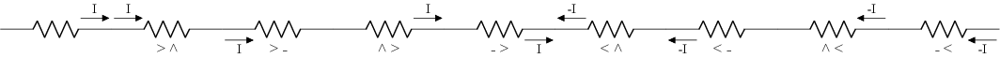 |
| [label-aligned](sch/21_etiquetas/label_aligned.sch) · Label aligned | r | etiqueta, etiquetas-globales | 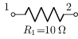 |
| [label-flip](sch/21_etiquetas/label_flip.sch) · Label flip | r | etiqueta, etiquetas-globales | 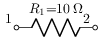 |
| [label-name](sch/21_etiquetas/label_name.sch) · Label name | r | etiqueta, etiquetas-globales | 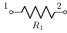 |
| [label-split](sch/21_etiquetas/label_split.sch) · Label split | r | etiqueta, etiquetas-globales | 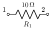 |
| [label-stacked](sch/21_etiquetas/label_stacked.sch) · Label stacked | r | etiqueta, etiquetas-globales | 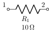 |
| [label-value](sch/21_etiquetas/label_value.sch) · Label value | r | etiqueta, etiquetas-globales | 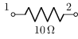 |
| [label-value-style](sch/21_etiquetas/label_value_style.sch) · Label value style | r,w | anotacion, etiqueta, etiquetas-globales, visibilidad-nodos | ⚠️ no renderiza |
| [labels1](sch/21_etiquetas/labels1.sch) · Labels1 | r | etiqueta, visibilidad-nodos | 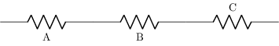 |
| [labels-loop](sch/21_etiquetas/labels_loop.sch) · Labels loop | r | etiqueta, etiqueta-v, geometria-global, visibilidad-nodos | 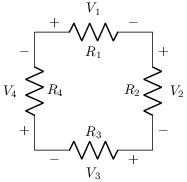 |
| [labels-loop-flip](sch/21_etiquetas/labels_loop_flip.sch) · Labels loop flip | r | etiqueta, etiqueta-v, etiquetas-globales, geometria-global, visibilidad-nodos | 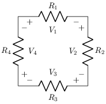 |
| [rlabels](sch/21_etiquetas/Rlabels.sch) · Rlabels | r | anotacion, etiqueta, geometria-global, visibilidad-nodos | 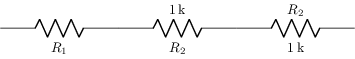 |
| [steppedwire0](sch/21_etiquetas/steppedwire0.sch) · Steppedwire0 | o,w | etiqueta, layout, rotacion |  |
| [steppedwire1](sch/21_etiquetas/steppedwire1.sch) · Steppedwire1 | o,w | etiqueta, layout, rotacion | 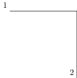 |
| [steppedwire2](sch/21_etiquetas/steppedwire2.sch) · Steppedwire2 | o,w | etiqueta, layout, rotacion | 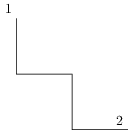 |
| [steppedwire4](sch/21_etiquetas/steppedwire4.sch) · Steppedwire4 | o,w | etiqueta, layout, rotacion | 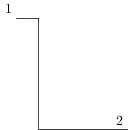 |
| [voltage-labels1](sch/21_etiquetas/voltage_labels1.sch) · Etiquetas de tensión | r | etiqueta, etiqueta-v, visibilidad-nodos | 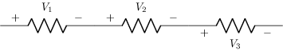 |
| [voltage-labels2](sch/21_etiquetas/voltage_labels2.sch) · Voltage labels2 | r | etiqueta, etiqueta-v, visibilidad-nodos | 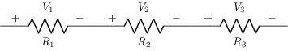 |
| [voltage-labels3](sch/21_etiquetas/voltage_labels3.sch) · Voltage labels3 | r | etiqueta, etiqueta-v, visibilidad-nodos |  |
| [wirestyles](sch/21_etiquetas/wirestyles.sch) · Wirestyles | w | estilo, etiqueta, grilla | 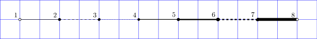 |
