# Introducción / quickstart

Tema `22_intro` · **27** ejemplos. Espejados de lcapy (LGPL). Buscá por tag con `rg -l "n2t-tags:.*<tag>" sch/22_intro/`.

> Curricular: **Teoría de Circuitos II**

| ejemplo | componentes | tags | vista |
|---|---|---|---|
| [circles](sch/22_intro/circles.sch) · Circles | o,shape | estilo, intro, rotacion | 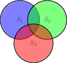 |
| [fit1](sch/22_intro/fit1.sch) · Fit1 | c,r,sw,w | etiqueta, etiquetas-globales, intro, raw-tikz, visibilidad-nodos | 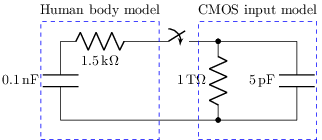 |
| [fit2](sch/22_intro/fit2.sch) · Fit2 | c,r,w | etiquetas-globales, intro, raw-tikz, visibilidad-nodos | 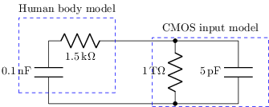 |
| [fit3](sch/22_intro/fit3.sch) · Fit3 | a,c,l,r,u,v,w | estilo, etiqueta, etiquetas-globales, intro, kind, kind:electrolytic, pines, raw-tikz | 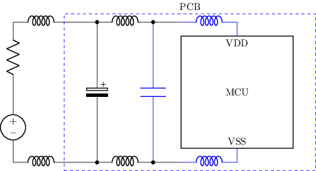 |
| [image1](sch/22_intro/image1.sch) · Image1 | shape | imagen, intro |  |
| [image2](sch/22_intro/image2.sch) · Image2 | shape | imagen, intro | 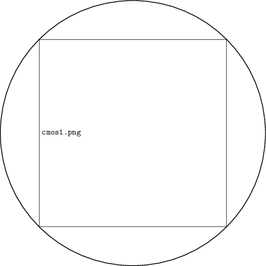 |
| [include1](sch/22_intro/include1.sch) · Include1 | w | intro | ⚠️ no renderiza |
| [include2](sch/22_intro/include2.sch) · Include2 | w | intro, visibilidad-nodos | ⚠️ no renderiza |
| [nodes1](sch/22_intro/nodes1.sch) · Nodes1 | r | estilo, etiqueta-nodo, intro, tierra | 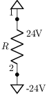 |
| [pindefs1](sch/22_intro/pindefs1.sch) · Pindefs1 | u | intro, pines | 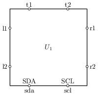 |
| [qnpright](sch/22_intro/Qnpright.sch) · Qnpright | q | intro |  |
| [rv1](sch/22_intro/RV1.sch) · RV1 | rv | intro, visibilidad-nodos | 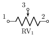 |
| [rv2](sch/22_intro/RV2.sch) · RV2 | r | intro, kind | 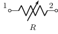 |
| [schematic](sch/22_intro/schematic.sch) · Schematic | c,r,v,w | etiqueta-i, etiqueta-v, etiquetas-globales, intro, visibilidad-nodos | 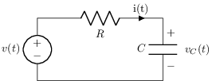 |
| [schematic2](sch/22_intro/schematic2.sch) · Schematic2 | c,r,v | etiquetas-globales, intro, tierra, visibilidad-nodos | 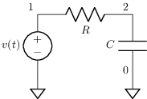 |
| [test1](sch/22_intro/test1.sch) · Test1 | w | etiqueta-i, intro | 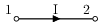 |
| [tfup](sch/22_intro/TFup.sch) · TFup | tf | intro | 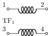 |
| [tofix1](sch/22_intro/tofix1.sch) · Tofix1 | c,r,w | etiquetas-globales, intro, visibilidad-nodos | 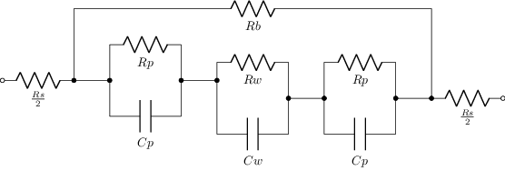 |
| [transforms](sch/22_intro/transforms.sch) · Transforms | shape,w | estilo, etiqueta, etiquetas-globales, forma, intro, layout, visibilidad-nodos | 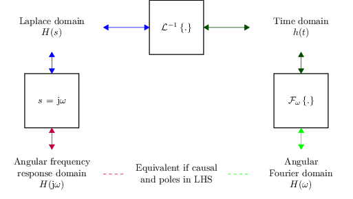 |
| [tricky1](sch/22_intro/tricky1.sch) · Tricky1 | c,r,w | etiquetas-globales, intro, visibilidad-nodos | 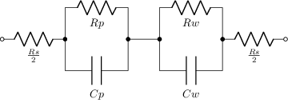 |
| [uamp](sch/22_intro/Uamp.sch) · Uamp | u | etiqueta, grilla, intro, pines | 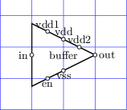 |
| [vacsup2](sch/22_intro/Vacsup2.sch) · Vacsup2 | c,v,w | intro | 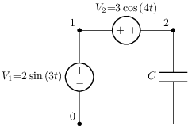 |
| [vrc1](sch/22_intro/VRC1.sch) · VRC1 | c,r,v,w | intro | 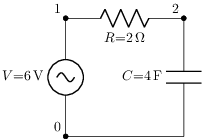 |
| [vrc1step](sch/22_intro/VRC1step.sch) · VRC1step | c,r,v,w | intro | 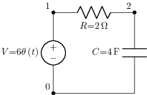 |
| [vrc2](sch/22_intro/VRC2.sch) · VRC2 | c,p,r,w | etiqueta-v, intro | 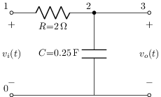 |
| [vrr1](sch/22_intro/VRR1.sch) · VRR1 | r,v,w | intro | 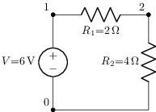 |
| [vsup3](sch/22_intro/Vsup3.sch) · Vsup3 | r,v,w | intro | 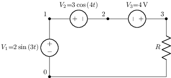 |
