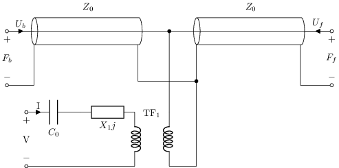
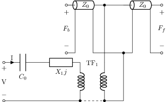
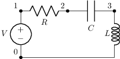
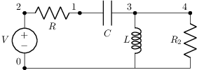

# Otros / transductores / varios

Tema `23_otros` · **4** ejemplos. Espejados de lcapy (LGPL). Buscá por tag con `rg -l "n2t-tags:.*<tag>" sch/23_otros/`.

| ejemplo | componentes | tags | vista |
|---|---|---|---|
| [klm2](sch/23_otros/KLM2.sch) · KLM2 | c,cable,p,tf,w,z | control, etiqueta, etiqueta-i, etiqueta-v, etiquetas-globales, kind, kind:coax, varios |  |
| [klm3](sch/23_otros/KLM3.sch) · KLM3 | c,p,tf,tl,w,z | control, estilo, etiqueta-i, etiqueta-v, etiquetas-globales, varios, visibilidad-nodos |  |
| [test1](sch/23_otros/test1.sch) · Test1 | c,l,r,v,w | varios |  |
| [test2](sch/23_otros/test2.sch) · Test2 | c,l,r,v,w | varios |  |
